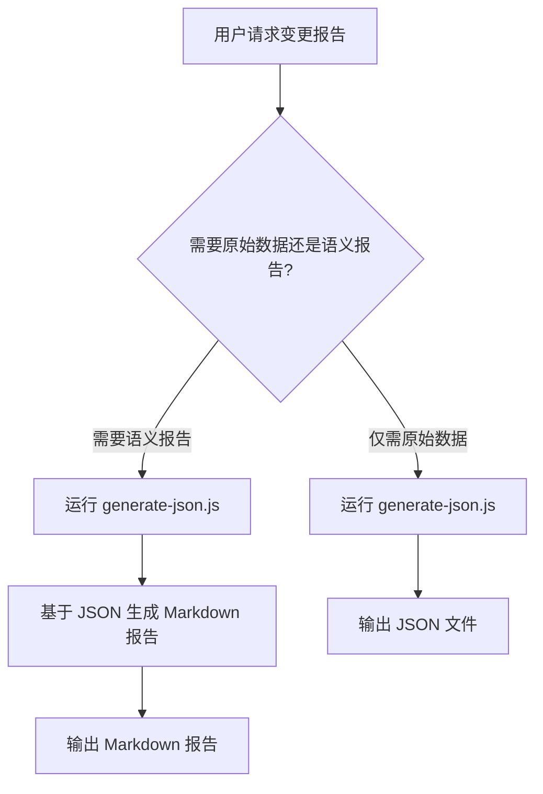

# Git Changes Reporter

## 概述

本技能提供两阶段 git 变更分析工作流：首先生成结构化 JSON 原始数据，然后基于 JSON 和代码解读生成语义化 Markdown 报告。JSON 数据为 Agent 提供完整上下文，Markdown 报告为工程师提供可读摘要。

## 工作流决策树



## 第一阶段：生成结构化 JSON 数据

### 何时使用

- 需要为 Agent 提供完整 git 变更上下文
- 需要原始数据用于进一步处理或分析
- CI/CD 流水线中存储变更记录

### 使用方法

运行脚本生成 JSON：

```bash
.claude/skills/git-changes-reporter/scripts/generate-json.js <old_commit> <new_commit> [output_path]
```

**参数说明**：

- `<old_commit>`：起始提交引用（commit hash、tag、branch）
- `<new_commit>`：结束提交引用
- `[output_path]`：可选输出路径，默认 `docs/reports/git-changes-YYYY-MM-DD.json`

**示例**：

```bash
# 分析最近 10 个提交
.claude/skills/git-changes-reporter/scripts/generate-json.js HEAD~10 HEAD

# 指定输出路径
.claude/skills/git-changes-reporter/scripts/generate-json.js v1.0.0 HEAD ./reports/changes.json
```

### JSON 数据结构

生成的 JSON 包含以下字段：

```json
{
  "range": {
    "old": "起始提交引用",
    "new": "结束提交引用",
    "label": "显示标签",
    "startDate": "起始日期",
    "endDate": "结束日期",
    "commitCount": "提交数量",
    "generatedAt": "生成时间"
  },
  "contributors": [{ "name": "作者名", "email": "邮箱", "commits": "提交数" }],
  "topDirs": [{ "dir": "目录名", "fileCount": "文件数" }],
  "commits": [
    {
      "hash": "完整提交哈希",
      "short": "短哈希",
      "author": "作者",
      "email": "邮箱",
      "authoredAt": "提交时间",
      "subject": "提交信息",
      "files": [
        {
          "path": "文件路径",
          "additions": "新增行数",
          "deletions": "删除行数",
          "patch": "差异内容"
        }
      ]
    }
  ]
}
```

### 脚本详情

参见 [scripts/generate-json.js](scripts/generate-json.js) 了解实现细节。该脚本：

- 验证 git 仓库状态
- 收集提交范围信息
- 提取每个提交的文件变更和 patch
- 生成结构化 JSON 输出

## 第二阶段：生成语义化 Markdown 报告

### 何时使用

- 需要人类可读的变更摘要
- 团队同步或代码审查
- 发布说明或变更日志
- 为工程师提供快速概览

### 工作流程

1. **加载 JSON 数据**：首先运行 `generate-json.js` 生成或加载现有 JSON 文件
2. **分析代码变更**：读取 JSON 中的 commits 和 files，必要时查看实际代码文件
3. **语义聚类**：按技术领域分组提交（错误处理、安全、功能、重构等）
4. **生成报告**：基于分析结果撰写 Markdown

### 报告结构模板

报告应包含以下部分：

```markdown
# Git 变更报告（<提交范围>）

## 1. 概览

- 时间范围：<startDate> 至 <endDate>
- 提交数量：<commitCount>
- 主要贡献者：<前 3 位作者>
- 热点目录：<前 3 个目录>

## 2. 改动聚焦领域

### 2.1 <领域 1：如错误处理与观测>

- **涉及目录**：<目录列表>
- **关键提交**：<短哈希列表及主题>
- **核心改动**：
  - <文件路径>：<改动描述>
  - <文件路径>：<改动描述>
- **设计意图**：<从代码和提交信息推断>

### 2.2 <领域 2：如安全与鉴权>

...

## 3. 贡献者分析

| 作者   | 提交数 | 主要领域 |
| ------ | ------ | -------- |
| <作者> | <数量> | <领域>   |

## 4. 技术影响与风险

- **兼容性影响**：<描述>
- **配置变更**：<描述>
- **性能影响**：<描述>
- **测试覆盖**：<描述>

## 5. 单提交摘要（附录）

### <短哈希> <作者> | <日期> | <标签>

**主题**：<原提交主题>

**变更要点**：

- <文件/目录>：<具体改动与目的>
- <接口/协议>：<变更描述>
- <行为/数据流>：<运行时影响>

**风险/影响**：

- <兼容性/配置/依赖影响>

**测试**：<测试文件或"未见测试记录">
```

### 写作指南

#### 语义聚类原则

- **错误处理与观测**：异常处理、日志、监控、指标
- **安全与鉴权**：认证、授权、加密、输入验证
- **功能开发**：新特性、API 扩展、业务逻辑
- **重构与优化**：代码整理、性能优化、架构调整
- **运维与部署**：配置、脚本、CI/CD、文档
- **依赖更新**：包版本升级、第三方库变更

#### 文件引用格式

- 使用完整路径：`apps/vendor-aster/src/quote.ts`
- 包含行号范围：`libraries/protocol/src/terminal.ts:138-143`
- 链接到代码：在 IDE 环境中使用可点击链接格式

#### 提交引用格式

- 短哈希：`03a48cfc4`
- 带主题：`03a48cfc4 (feat: enforce terminal_id...)`
- 在描述中显式关联：`在 03a48cfc4 中，CZ 改进了...`

**⚠️ 重要警告：不要使用 JSON 文件行号作为 commit ID**

- JSON 文件中的行号（如 `1279`、`703`）只是文件位置，不是 commit 标识符
- 正确的 commit ID 在 JSON 的 `"short"` 字段中（如 `"a9300e76f"`）
- 错误示例：`1279`（行号） ❌
- 正确示例：`a9300e76f`（短哈希） ✅

#### 语气与风格

- **客观专业**：面向工程同事，基于事实
- **简明扼要**：短段落，列表优先，表格用于比较
- **中英混合**：正文使用中文，代码/命令使用英文
- **聚焦意图**：不仅描述"做了什么"，还要解释"为什么"

### 质量检查清单

生成报告后检查：

- [ ] 范围正确，起止提交无误
- [ ] 每个技术领域有具体文件引用
- [ ] 作者贡献分析完整
- [ ] 识别了潜在风险和建议
- [ ] 单提交摘要覆盖关键点
- [ ] 报告结构清晰，易于导航
- [ ] **commit 引用使用正确的短哈希，而不是 JSON 文件行号**

## 高级用法

### GitHub Commit 链接生成

对于 GitHub 仓库，可以使用附加脚本生成 commit 链接：

```bash
.claude/skills/git-changes-reporter/scripts/generate-github-links.js <json_file> <repo_url>
```

该脚本会为 JSON 中的每个 commit 添加 `githubUrl` 字段，格式为：`https://github.com/<owner>/<repo>/commit/<hash>`

### CI/CD 集成示例

在 GitHub Actions 中每日生成报告：

```yaml
name: Daily Change Report
on:
  schedule:
    - cron: '0 9 * * *' # 每天 9:00 UTC
  workflow_dispatch:

jobs:
  generate-report:
    runs-on: ubuntu-latest
    steps:
      - uses: actions/checkout@v4
        with:
          fetch-depth: 0 # 获取完整历史

      - name: Generate JSON data
        run: |
          .claude/skills/git-changes-reporter/scripts/generate-json.js \
            "$(git rev-list -n 1 --before='24 hours ago' HEAD)" \
            HEAD \
            ./reports/daily-changes.json

      - name: Upload artifact
        uses: actions/upload-artifact@v4
        with:
          name: daily-change-report
          path: ./reports/
```

> **完整自动化工作流**：项目中包含完整的 GitHub Actions 工作流文件 `.github/workflows/daily-git-report.yml`，使用 `claude-code-action` 配置 DeepSeek API 自动生成报告并创建 PR。

### 与现有工具集成

- **JIRA/GitHub Issues**：在报告中引用相关 issue ID
- **Slack/Teams**：生成简要摘要发送到聊天频道
- **文档系统**：将报告集成到内部 wiki 或文档站点

## 故障排除

### 常见问题

1. **无提交找到**：检查提交引用是否存在，确认仓库有足够历史
2. **JSON 解析错误**：确保脚本在 git 仓库根目录运行
3. **权限问题**：确认有权限创建输出目录
4. **内存不足**：对于大量提交，考虑增加 Node.js 内存限制

### 性能优化

- 对于大型提交范围（>100 commits），考虑：
  - 使用 `--no-patch` 选项减少内存使用
  - 分批处理提交
  - 仅分析关键目录

## 资源

### 脚本文件

- [generate-json.js](scripts/generate-json.js) - 生成结构化 JSON 数据
- [generate-github-links.js](scripts/generate-github-links.js) - 为 commit 添加 GitHub 链接

### 报告模板

- [report-template.md](references/report-template.md) - 详细的报告结构、写作指南和示例

### 脚本文档

- [scripts/README.md](scripts/README.md) - 脚本使用说明和示例

### 参考实现

基于现有 `recent-changes-digest` 技能改进，提供更规范的接口和更清晰的文档。
