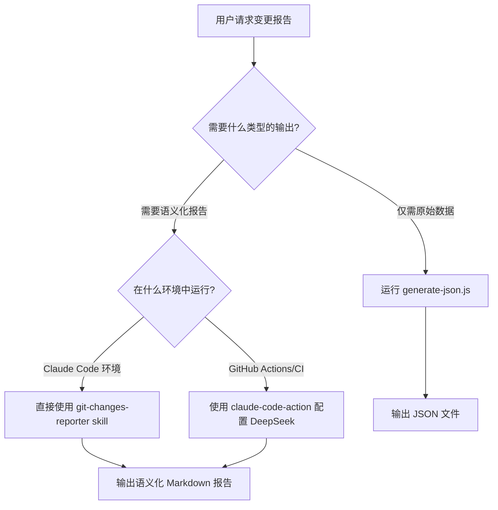
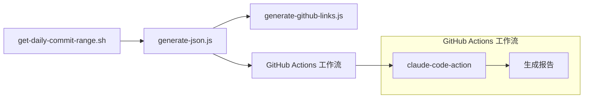

# Git Changes Reporter Scripts

本目录包含 `git-changes-reporter` 技能的脚本文件，提供完整的 Git 变更分析工作流。

## 脚本说明

### 核心脚本

#### generate-json.js

生成结构化 JSON 数据，包含指定提交范围内的完整变更信息。这是整个工作流的基础。

**何时使用**：

- 需要为 Agent 提供完整的 git 变更上下文
- 需要原始数据用于进一步处理或分析
- CI/CD 流水线中存储变更记录

**用法**：

```bash
node .claude/skills/git-changes-reporter/scripts/generate-json.js <old_commit> <new_commit> [output_path]
```

**示例**：

```bash
# 分析最近 10 个提交
node .claude/skills/git-changes-reporter/scripts/generate-json.js HEAD~10 HEAD

# 从特定标签开始分析
node .claude/skills/git-changes-reporter/scripts/generate-json.js v1.0.0 HEAD ./releases/v1.1.0-changes.json

# 使用具体 commit hash
node .claude/skills/git-changes-reporter/scripts/generate-json.js 6df6ea741 1b4e97ac5
```

**输出文件**：

- 默认：`docs/reports/git-changes-YYYY-MM-DD.json`
- 包含：提交范围、贡献者、文件热度、每个提交的详细信息和 patch

#### generate-github-links.js

为 JSON 数据中的每个 commit 添加 GitHub 链接。

**何时使用**：

- 在 GitHub 仓库中生成报告时
- 需要为每个提交提供可点击的链接
- 生成包含完整上下文的报告

**用法**：

```bash
node .claude/skills/git-changes-reporter/scripts/generate-github-links.js <json_file> <repo_url> [output_file]
```

**示例**：

```bash
# 为 changes.json 添加 GitHub 链接
node .claude/skills/git-changes-reporter/scripts/generate-github-links.js ./reports/changes.json https://github.com/owner/repo

# 指定输出文件
node .claude/skills/git-changes-reporter/scripts/generate-github-links.js changes.json https://github.com/owner/repo ./changes-with-links.json
```

**功能**：

- 为每个 commit 添加 `githubUrl` 字段
- 在 metadata 中添加仓库信息
- 生成可点击的 commit 链接

### 自动化脚本

#### get-daily-commit-range.sh

提取东八区昨日 8 点到今日 8 点的 commit 范围。

**何时使用**：

- 每日报告工作流中计算时间范围
- 需要根据时区偏移计算 commit 范围
- GitHub Actions 自动化

**用法**：

```bash
./get-daily-commit-range.sh [timezone_offset]
```

**示例**：

```bash
# 默认东八区（+8）
./get-daily-commit-range.sh

# 指定时区偏移
./get-daily-commit-range.sh +9  # 东九区
./get-daily-commit-range.sh -5  # 西五区
```

**输出**：

- 起始 commit hash
- 结束 commit hash（通常是 HEAD）
- 提交数量
- 短哈希版本

## 工作流决策树



## 完整工作流示例

### 场景 4：添加 GitHub 链接

```bash
# 1. 生成 JSON 数据
node .claude/skills/git-changes-reporter/scripts/generate-json.js v1.0.0 v1.1.0 ./releases/v1.1.0-changes.json

# 2. 添加 GitHub 链接
node .claude/skills/git-changes-reporter/scripts/generate-github-links.js \
  ./releases/v1.1.0-changes.json \
  https://github.com/owner/repo \
  ./releases/v1.1.0-changes-with-links.json

# 3. 查看带链接的数据
jq '.commits[0] | {short: .short, subject: .subject, url: .githubUrl}' \
  ./releases/v1.1.0-changes-with-links.json
```

## 在 CI/CD 中使用

### GitHub Actions 每日报告工作流

完整的工作流文件位于 `.github/workflows/daily-git-report.yml`，包含以下步骤：

1. **获取每日提交范围**：使用 `get-daily-commit-range.sh` 计算时间范围
2. **生成 JSON 数据**：调用 `generate-json.js` 生成结构化数据
3. **通过 Claude Code Action 生成报告**：使用 `anthropics/claude-code-action@v1` 调用 git-changes-reporter skill
4. **检查报告生成**：验证报告文件是否成功生成
5. **创建 Pull Request**：自动创建包含报告文件的 PR
6. **上传制品**：将报告文件上传为工作流制品

### 环境变量配置

工作流使用以下环境变量配置 DeepSeek API：

```yaml
env:
  ANTHROPIC_AUTH_TOKEN: ${{ secrets.ANTHROPIC_AUTH_TOKEN }}
  ANTHROPIC_BASE_URL: 'https://api.deepseek.com/anthropic'
  ANTHROPIC_MODEL: 'deepseek-reasoner'
  ANTHROPIC_SMALL_FAST_MODEL: 'deepseek-chat'
  API_TIMEOUT_MS: '600000'
  CLAUDE_CODE_MAX_OUTPUT_TOKENS: '32000'
  CLAUDE_CODE_DISABLE_NONESSENTIAL_TRAFFIC: '1'
```

### 手动触发工作流

```bash
# 在 GitHub Actions 页面手动触发
# 或使用 GitHub CLI
gh workflow run daily-git-report.yml
```

## 脚本关系图



## 故障排除

### 常见问题

1. **脚本无法执行**：

   ```bash
   # 添加执行权限（shell脚本需要，JavaScript文件通过 node 运行）
   chmod +x get-daily-commit-range.sh
   ```

2. **Node.js 模块错误**：

   ```bash
   # 确保使用正确的 Node.js 版本（>= 18.15.0）
   node --version

   # 安装必要的 Node.js 模块（如果需要）
   # 当前脚本使用内置模块，通常无需额外安装
   ```

3. **内存不足**：

   ```bash
   # 对于大型仓库，增加内存限制
   NODE_OPTIONS="--max-old-space-size=4096" node generate-json.js HEAD~50 HEAD
   ```

4. **Git 错误**：

   ```bash
   # 确保在 git 仓库中运行
   git rev-parse --is-inside-work-tree

   # 确保有足够的 git 历史
   git log --oneline -5
   ```

5. **DeepSeek API 错误**：

   ```bash
   # 检查 GitHub Secrets 配置
   echo "检查 ANTHROPIC_AUTH_TOKEN 是否在 GitHub Secrets 中正确设置"

   # 检查 API 端点可达性
   curl -I https://api.deepseek.com/anthropic
   ```

6. **报告生成失败**：

   ```bash
   # 检查 JSON 文件是否有效
   jq . docs/reports/git-changes-2025-12-02.json

   # 检查网络连接
   curl -I https://api.deepseek.com
   ```

### 性能提示

- **大型提交范围**（>100 commits）：

  ```bash
  # 分批处理
  node .claude/skills/git-changes-reporter/scripts/generate-json.js HEAD~100 HEAD~50 ./reports/part1.json
  node .claude/skills/git-changes-reporter/scripts/generate-json.js HEAD~50 HEAD ./reports/part2.json
  ```

- **减少内存使用**：

  ```bash
  # 修改脚本使用 --no-patch 选项
  NODE_OPTIONS="--max-old-space-size=2048" node .claude/skills/git-changes-reporter/scripts/generate-json.js ...
  ```

- **定期清理**：
  ```bash
  # 保留最近7天的报告
  find docs/reports -name "git-changes-*.json" -mtime +7 -delete
  find docs/reports -name "git-changes-report-*.md" -mtime +7 -delete
  ```

## 重要警告和最佳实践

### ⚠️ 提交引用规则（最重要）

- **必须使用短哈希**：如 `03a48cfc4`
- **绝对不要使用 JSON 文件行号**：JSON 文件中的行号（如 `1279`、`703`）只是文件位置，不是 commit 标识符
- 正确示例：`a9300e76f`（短哈希） ✅
- 错误示例：`1279`（行号） ❌

### 报告质量检查清单

生成报告后检查：

- [ ] 范围正确，起止提交无误
- [ ] 每个技术领域有具体文件引用
- [ ] 作者贡献分析完整
- [ ] 识别了潜在风险和建议
- [ ] 单提交摘要覆盖关键点
- [ ] 报告结构清晰，易于导航
- [ ] **commit 引用使用正确的短哈希，而不是 JSON 文件行号**

### 安全注意事项

- **API 密钥管理**：不要在代码中硬编码 DeepSeek API 密钥
- **GitHub Secrets**：在 CI/CD 中使用 GitHub Secrets 存储敏感信息
- **输出文件权限**：确保报告文件有适当的访问权限
- **数据清理**：定期清理包含敏感信息的临时文件

## 输出数据结构

### generate-json.js 输出

```json
{
  "range": {
    "old": "起始提交引用",
    "new": "结束提交引用",
    "label": "显示标签（短哈希范围）",
    "startDate": "起始日期（YYYY-MM-DD）",
    "endDate": "结束日期（YYYY-MM-DD）",
    "commitCount": 42,
    "generatedAt": "2025-12-02T15:30:00Z"
  },
  "contributors": [{ "name": "作者名", "email": "邮箱", "commits": 10 }],
  "topDirs": [{ "dir": "目录名", "fileCount": 15 }],
  "commits": [
    {
      "hash": "完整提交哈希",
      "short": "短哈希（8-10字符）",
      "author": "作者",
      "email": "邮箱",
      "authoredAt": "提交时间（ISO 8601）",
      "subject": "提交信息主题",
      "files": [
        {
          "path": "文件路径",
          "additions": 5,
          "deletions": 3,
          "patch": "差异内容（可选）"
        }
      ]
    }
  ],
  "metadata": {
    "tool": "git-changes-reporter",
    "version": "1.0.0",
    "repository": "/path/to/repo"
  }
}
```

### generate-github-links.js 增强后

```json
{
  ...,
  "commits": [
    {
      "hash": "abc123def456...",
      "short": "abc123def",
      "githubUrl": "https://github.com/owner/repo/commit/abc123def456...",
      ...
    }
  ],
  "metadata": {
    ...,
    "github": {
      "repository": "owner/repo",
      "baseUrl": "https://github.com/owner/repo",
      "commitUrlTemplate": "https://github.com/owner/repo/commit/{hash}"
    }
  }
}
```

### 语义化报告结构（Markdown）

```markdown
# Git 变更报告（提交范围）

## 1. 概览

- 时间范围：起始日期 至 结束日期
- 提交数量：42
- 主要贡献者：作者 1, 作者 2, 作者 3
- 热点目录：目录 1, 目录 2, 目录 3

## 2. 改动聚焦领域

### 2.1 错误处理与观测

- **涉及目录**：目录列表
- **关键提交**：短哈希列表及主题
- **核心改动**：
  - 文件路径：改动描述
  - 文件路径：改动描述
- **设计意图**：从代码和提交信息推断

### 2.2 安全与鉴权

...

## 3. 贡献者分析

| 作者 | 提交数 | 主要领域 |
| ---- | ------ | -------- |
| 作者 | 数量   | 领域     |

## 4. 技术影响与风险

- **兼容性影响**：描述
- **配置变更**：描述
- **性能影响**：描述
- **测试覆盖**：描述

## 5. 单提交摘要（附录）

### 短哈希 作者 | 日期 | 标签

**主题**：原提交主题

**变更要点**：

- 文件/目录：具体改动与目的
- 接口/协议：变更描述
- 行为/数据流：运行时影响

**风险/影响**：

- 兼容性/配置/依赖影响

**测试**：测试文件或"未见测试记录"
```

## 相关资源

### 文档文件

- [SKILL.md](../SKILL.md)：git-changes-reporter 技能完整文档
- [report-template.md](../references/report-template.md)：详细的报告模板和写作指南
- [scripts/README.md](./README.md)：本文件

### 配置文件

- `.github/workflows/daily-git-report.yml`：GitHub Actions 工作流
- `tools/git-changes-reporter/`：TypeScript 版本的工具项目

### 参考实现

- 基于现有 `recent-changes-digest` 技能改进
- 提供更规范的接口和更清晰的文档
- 支持 TypeScript 和 rush 集成

---

> 最后更新：2025-12-03
> 维护者：Claude Code
> 版本：1.0.0
