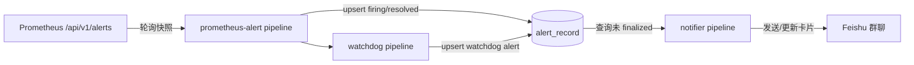
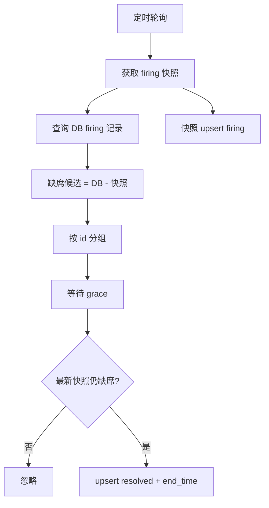
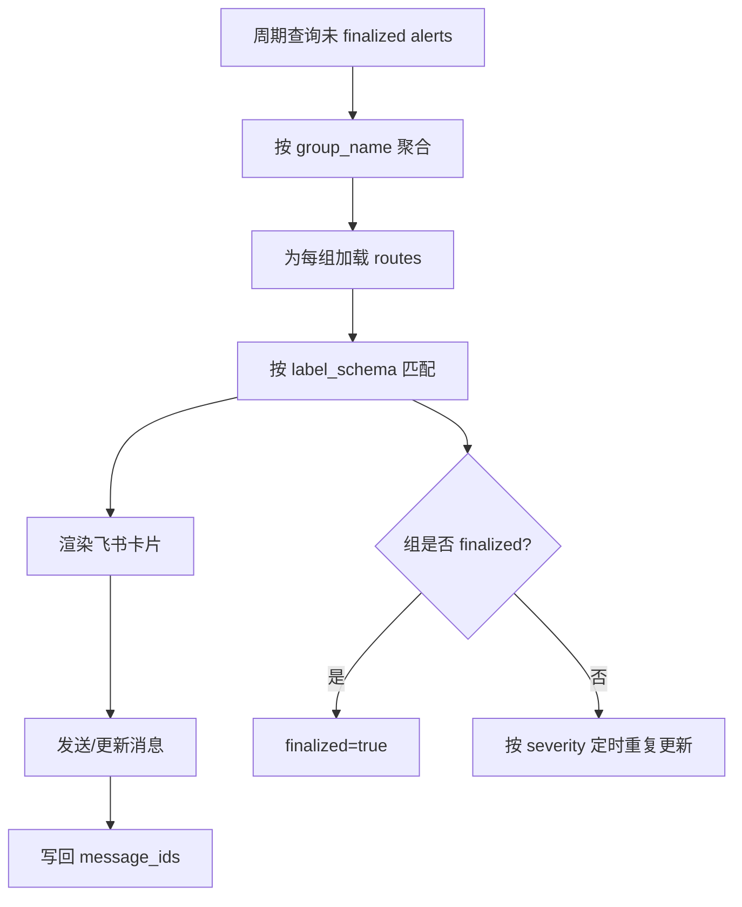

# Alert Receiver 设计说明

`alert-receiver` 是 Yuan 的告警接收与通知服务。它从 Prometheus 获取当前 firing 告警快照，写入数据库形成告警历史，并基于路由规则将告警以飞书卡片的形式发送/更新到各个群聊。

本 README 说明该项目的核心设计、数据模型与运行流程（含流程图），作为维护与排障的主要参考。

## 目标与原则

**目标**

- 可靠记录 Prometheus firing/resolved 的状态演进。
- 通过数据库驱动的通知系统，向飞书发送告警卡片，并在状态变化时更新。
- receiver 自身不稳定时，仍能在恢复后补齐 missing resolved，避免“只触发不恢复”。

**关键原则**

- **SOT（唯一事实来源）是 Prometheus `/api/v1/alerts` 的 firing 快照**。receiver 不推导额外状态。
- **resolved 的产生来自快照对账**：某个 alert 在 DB 里仍为 firing，但在当前快照中缺席，并在 grace 时间后复核仍缺席，才写 resolved。
- 所有写库均为 **幂等 upsert**（以 `id` 作为冲突键）。

## 总体架构

服务由三个长期运行的 pipeline 组成：

- `prometheus-alert`：轮询 Prometheus 获取 firing 快照并对账写库。
- `notifier`：从 DB 读取未 finalized 的告警组，按路由生成飞书卡片并发送/更新。
- `watchdog`：监控 Prometheus 拉取是否连续成功，失败则触发自身的 watchdog 告警。



## 数据模型

### `alert_record`

每条告警实例一行记录，核心字段：

- `id`：由 labels 计算出的 fingerprint，作为全局唯一键。
- `labels`：原始 labels（含 `alertname`、`severity`、`env`、`prometheus` 等）。
- `status`：`firing` 或 `resolved`。只要 `status='firing'` 即视为 open。
- `start_time` / `end_time`：开始与结束时间。`end_time` 为 receiver 观测到缺席并复核通过的时刻。
- `group_name`：由关键 labels 计算的告警组键。
- `message_ids`：已发送到飞书的 route-message 映射，用于后续更新。
- `finalized`：告警组全 resolved 后置为 `true`，表示不再参与通知。

### `alert_receive_route`

告警接收路由配置：

- `chat_id`：飞书群聊 ID。
- `label_schema`：用于筛选告警的 JSON Schema。
- `urgent_on_severity` / `urgent_user_list` / `urgent_type`：满足条件时的加急策略。
- `enabled`：是否启用。

## Prometheus 快照对账流程

对应实现：`apps/alert-receiver/src/pipelines/prometheus-alert.ts`。

1. **拉取 firing 快照**：通过 terminal 服务 `prometheus/alerts` 轮询 `/api/v1/alerts`，仅保留 `state='firing'` 的告警。
2. **查询 DB 当前 firing**：从 `alert_record` 中选出 `status='firing'` 且同一 `prometheus/env` 范围内的记录。
3. **计算缺席候选**：`missing = dbFiring - currentSnapshot`。
4. **防抖复核**：对每个 `missing.id` 等待 `ALERT_RESOLVE_GRACE_MS`，到期后再次检查当前快照，若仍缺席则确认为 resolved。
5. **写库**：
   - 当前快照全量 upsert 为 `firing`。
   - 复核通过的缺席候选 upsert 为 `resolved` 并填充 `end_time`。



**一致性特性**

- receiver 宕机期间不会产生 resolved；恢复后第一轮对账会补齐。
- grace 只用于防抖（避免短暂抖动误关），不会推导额外状态。
- DB 读失败时不会阻塞写入快照（仍会持续 upsert firing）。

## 通知发送流程

对应实现：`apps/alert-receiver/src/pipelines/notifier.ts`。

1. 周期性查询 `alert_record` 中 `finalized=false` 的记录，按 `group_name` 聚合成告警组。
2. 为每个告警组：
   - 拉取启用的 `alert_receive_route`。
   - 依据 `label_schema` 过滤匹配的 alerts，计算组级 severity/status/version。
   - 根据 `message_ids` 判断是“发送新卡片”还是“更新已有卡片”。
3. 更新 `message_ids` 写回 DB；若组内无 firing，则置 `finalized=true` 并清空 message_ids。
4. 对仍 firing 的组按 severity 设定不同的重复更新间隔（防止卡片失活）。



## Watchdog 流程

对应实现：`apps/alert-receiver/src/pipelines/watchdog.ts`。

- 若连续 60 秒没有 Prometheus 拉取成功信号，则产生 `PrometheusFetchWatchdog` firing。
- 一旦再次拉取成功，立即写 resolved。
- watchdog 同样写入 `alert_record`，与普通告警统一展示和通知。

## 运行与配置

**必要环境变量**

- `ENV`：环境名（写入 labels/env）。
- `PROMETHEUS_NAME`：Prometheus 实例名（写入 labels/prometheus）。

**可选环境变量**

- `ALERT_RESOLVE_GRACE_MS`：缺席防抖时间，默认 `15000` 毫秒。

**依赖的 terminal 服务**

- `prometheus/alerts`：获取 Prometheus alerts 快照。
- `sql/*`：读写 `alert_record` 与 `alert_receive_route`。
- `Feishu/SendMessage`、`Feishu/UpdateMessage`：发送/更新飞书卡片。

## 开发与测试

在 `apps/alert-receiver` 下运行：

```bash
npm run build
```

包含 TypeScript 编译、Jest 测试与 API Extractor 校验。若 post-build 报 Node 版本范围错误，请切换到仓库支持的 Node 版本后重试。
