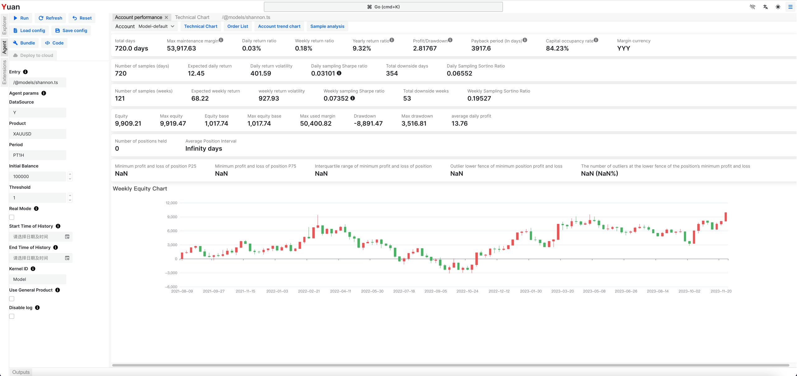
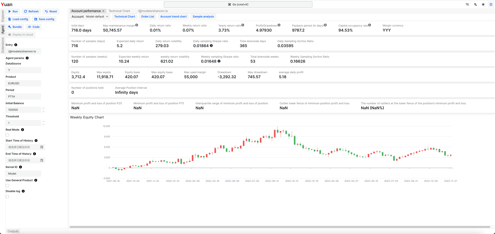

# Creating your first strategy

[Claude Elwood Shannon](https://en.wikipedia.org/wiki/Claude_Shannon) was an American mathematician, electrical engineer, and cryptographer known as "the father of information theory". He found a simple investment strategy that can be used to beat the market. The strategy is called the _Shannon's Rebalance_, _Shannon's Demon_ or _Shannon's Infinite Grid_.

The key idea is to rebalance your portfolio in regular. The rebalancing is done by selling the assets that have grown in value and buying the assets that have fallen in value.

It's very easy to understand and implement. Let us introduce the strategy in detail.

A classic instance is keep 50% currency and 50% position.

For example, if you have 1000 USD to invest Gold. You can buy 500 USD Gold and keep 500 USD currency.
Always re-evaluate the value of Gold and currency, do re-balancing if need, keep 50% Gold and 50% currency.
If Gold price goes up, you sell some Gold to keep the balance.
If Gold price goes down, you buy Gold to keep the balance.
In long term, even if gold price doesn't raise, you can still make profit by re-balancing.

Let's see how to implement and test this strategy in the following sections.

## Open your workspace

First, open your workspace. If you don't have one, please create one.

If you are accessing Yuan in desktop device, please follow the steps below:

1. Click the "Open Workspace..." button on the home page.
2. Read the privacy declaration and click "Agree" button.
3. Select a local folder as your workspace folder. Recommend to use an empty folder.
4. Confirm to import the example project. It's important to import some utils.
5. Click the "Explorer" on the left panel, you will see the workspace folder. (That's the folder you selected in step 3)
6. You can find some folders and files in the workspace folder now.
7. Well done! We will work in this workspace later.

If you are accessing the website from a mobile device (or you cannot find "Open Workspace" button), your device doesn't support to open a local folder, please follow the steps below:

1. Click the "Explorer" on the left panel, you will see the workspace folder. It's empty by default.
2. Click the "Import Examples" button on the top of Explorer panel. It's import to import some utils.
3. You can find some folders and files in the workspace folder now.
4. Well done! We will work in this workspace later.

## Create a new agent

Trading strategy is named as "agent" in Yuan. Let's create a new agent.

1. Tap the mouse on the "..." button of the root folder in the Explorer panel.
2. Click the "Create File" button.
3. Input the file name as `shannon.ts`. (or any other name you like, but the file extension must be `.ts`)
4. You can see the new file `shannon.ts` in the Explorer panel now.
5. Tap the mouse on the "..." button of the `shannon.ts` file.
6. Click the "Editor" button, so we can open a editor.
7. Well done! We will write the code in this editor later.

:::tip
You can also use your favorite editor (e.g. VSCode) to edit the file. Yuan will detect the file change and reload the agent automatically.
:::

## Time to hello world

Now, let's write the code in the editor. The following code is a basic framework of an agent.

```ts
export default () => {
  console.info('Hello, World!');
};
```

1. Tap the mouse on the "..." button of the `shannon.ts` file.
2. Click the "Run Agent" button, so we can open the agent configuration form.
3. It's a complex form, but we can ignore it now. Just click the "Run" button.
4. Instantly, you can see "Run completed" message on the top of page and "Account Performance" panel is shown.
5. Open the "Outputs" panel on the bottom of page, you can find the "Hello, World!" message. (maybe plenty of other irrelative messages)
6. "Account Performance" should be empty now, because we haven't done any trading yet.
7. Well done! We have run our first agent.

:::info
You can find more details about the agent in the [Guide - Agent](/docs/category/guide---agent) section.
:::

## Implement the strategy

:::info
The complete code can be found in `/@models/shannon.ts` of your workspace.
If you have trouble with coding. You can use it directly and skip this section.
:::

Now, let's implement the strategy step by step.

### Get the data

```ts
export default () => {
  // Define parameters of the agent
  const datasource_id = useParamString('DataSource', 'Y');
  const product_id = useParamString('Product');
  const period = useParamString('Period', 'PT1H');
  const currency = useParamString('Currency', 'USD');
  // Get the product information and price data
  const product = useProduct(datasource_id, product_id);
  const { close } = useOHLC(datasource_id, product_id, period);
};
```

1. We use `useParamString` to get the parameters from the agent configuration form.

   You can find the parameter in the "Agent" form after you click "Refresh" button on the top of "Agent" panel.

2. We use `useProduct` to get the product information.

   The detail of product can be found in the _[What is Product](/docs/basics/what-is-product)_.

3. We use `useOHLC` to get the price data. We only need the `close` price now.

   Variable `close` is a series of price data. It's almost a array of numbers.

   'PT1H' is the period of the price data. It means 1 hour. It's a string format of [ISO 8601 Duration](https://en.wikipedia.org/wiki/ISO_8601#Durations).

   Some other examples: 'PT1M' means 1 minute, 'PT15M' means 15 minutes, 'P1D' means 1 day, 'P1W' means 1 week.

Following the below steps to re-run the code:

1. Open the "Agent" panel on the left of the page.
2. Click "Refresh" button on the top of "Agent" panel.
3. You can find the parameters defined above in the "Agent params" section.
4. You can see some default value of the parameters. You can change them if you like.
5. Fill the "Product" parameter with `XAUUSD`. It's the product id of Gold.
6. Click "Run" button on the top of "Agent" panel.
7. Soon, you can see a new "Account Performance" panel is shown.
8. It's still empty values in the "Account Performance" panel, because we haven't done any trading yet.
9. Click "Technical Chart" button on the top of "Account Performance" panel.
10. You can see the price chart of Gold now.
11. Well done! We have got the data.

### Build the strategy

We need to monitor the price, calculate the expected position to hold. If the error of expected position and actual position is big enough, we can do re-balancing.

1. Define the **initial balance** and **threshold of error** as parameters, so that you can adjust them without changing the code.
2. Use API `useAccountInfo` to get the account information. So we can get the equity of the account.
3. Use API `useSimplePositionManager` to get the current position and set the target position. It's a simple position manager. It will do order operation to move your position to the target volume. It's very useful for some simple strategies.
4. Define the **total value** is the sum of equity and initial balance. Because the initial equity of the account is zero. Yuan allow the account to have negative equity to show more details of the strategy.
5. The total value of the position is half of the total value. Because we want to keep 50% currency and 50% position.
6. We can infer the position volume to hold from the total value of the position and the price of the product.
7. Calculate the error rate of the expected position volume to actual.
8. Set target volume if the error rate is big enough.
9. Note that the position volume has a minimum step (`volume_step`). We need to round the order volume to the step.
10. Check the above every hour by use `useEffect` hook and set the second parameters with `[close.length]`.

```ts
import { useSimplePositionManager } from '@libs';
export default () => {
  // ...
  // More parameters
  const initial_balance = useParamNumber('Initial Balance', 100_000);
  const threshold = useParamNumber('Threshold', 1);
  // Get the account information
  const accountInfo = useAccountInfo({ currency });
  // Use a simple position manager
  const [actualVolume, setVolume] = useSimplePositionManager(accountInfo.account_id, product_id);
  // Re-balance the position
  useEffect(() => {
    if (close.length < 2) return;
    const price = close[close.length - 1];
    const totalValue = accountInfo.money.equity + initial_balance;
    const totalValueToHold = totalValue * 0.5;
    // infer the volume to hold
    const valuePerVolume =
      (product.value_scale ?? 1) *
      (product.value_scale_unit ? 1 : price) *
      (product.quote_currency === accountInfo.money.currency ? 1 : -1 / price);
    const expectedVolume = totalValueToHold / valuePerVolume;
    // calculate the error rate
    const volume_step = product.volume_step ?? 1;
    const errorRate = Math.abs((actualVolume - expectedVolume) / volume_step);
    if (errorRate > threshold) {
      setVolume(roundToStep(expectedVolume, volume_step));
    }
  }, [close.length]);
};
```

## Back-test the strategy

We have completed the agent code. Now, let's back-test the strategy.

1. Fill the "Product" parameter with `XAUUSD`. It's the product id of Gold.
2. Click "Run" button on the top of "Agent" panel.
3. Soon, you can see a new "Account Performance" panel is shown.
4. Well done! We have back-tested the strategy in the product Gold.



You can also back-test the strategy in other products. For example, you can back-test the strategy in the product `EURUSD`.



- You can click the "Technical Chart" button on the top of "Account Performance" panel to view the trading detail of this strategy.
- You can click the "Order List" button on the top of "Account Performance" panel to view the order list of this strategy.
- If you want to deploy the strategy to real market, you can click the "Deploy to Cloud" button on the top of "Agent" panel.

## Further Reading

There are some other examples in the `/@models` folder of your workspace. You can learn more from them.

If you want to learn more about the Yuan, please read the [Guide - Agent](/docs/category/guide---agent) section.

:::warning[Disclaimer]
These materials have been prepared solely for informational purposes and do not constitute a recommendation to make or dispose of any investment or engage in any particular investment strategy. These materials include general information and have not been tailored for any specific recipient or recipients. Information or data shown or used in these materials were obtained from sources believed to be reliable, but accuracy is not guaranteed.
:::
