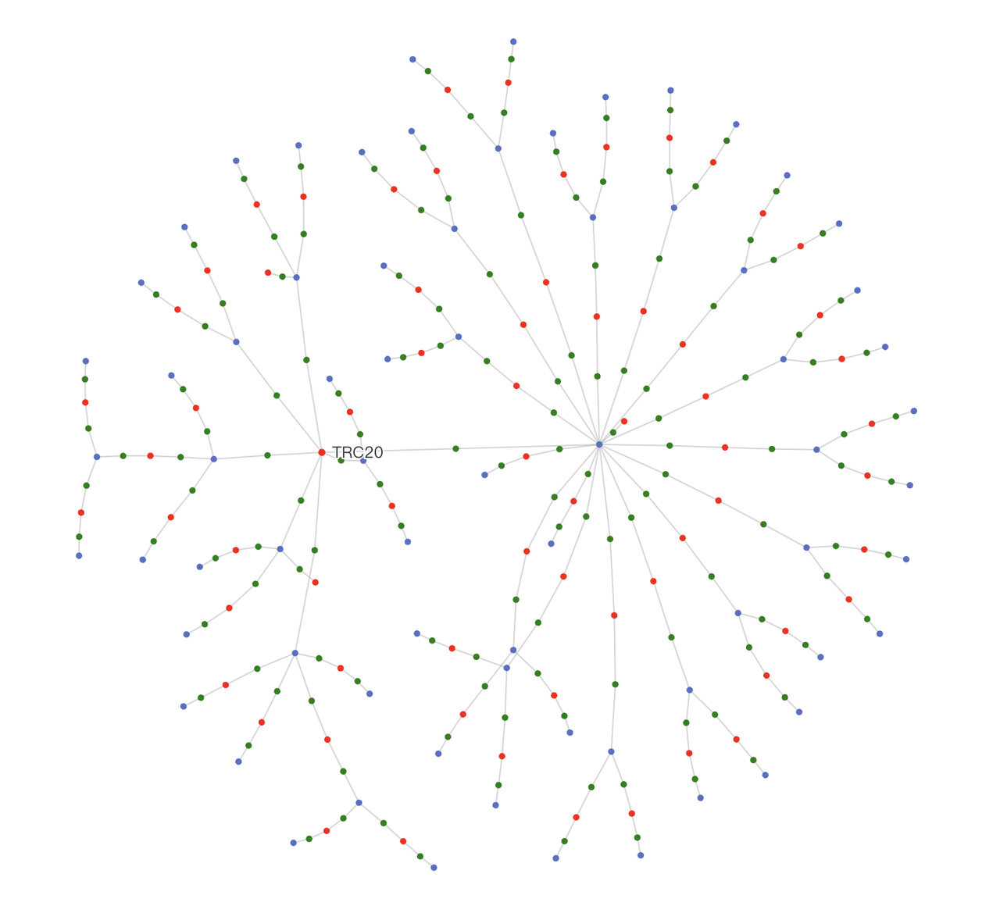

# 转账

转帐，目的是将指定**贷方账户**中，指定数量的指定货币，转入**借方账户**中。

- **支持**同一网络中的账户之间的直接转账。例如：在 ERC20 网络中的 USDT 转账到 ERC20 网络中的 USDT。
- **支持**同一货币在不同网络之间的自动寻路转账。例如：在 ERC20 网络中的 USDT 转账到 TRC20 网络中的 USDT。
- **不支持**不同货币之间的转账，这需要进行交易。例如：USDT 转账到 BTC。

**转账订单 (Transfer Order)**，用于描述一次转账的具体信息，包括转账的目的和状态等。

发起转账订单时，至少需要指明**转账四要素：贷方账户、借方账户、货币名称、转账金额**。

## 执行转账与转账网络

如果两个账户处于同一个转账网络，那么这两个账户之间就可以直接转账。例如 SWIFT、ACH、Wise、UnionPay、AliPay、BlockChain 等。

转账网络由三种元素构成：

- 网络: 一个抽象概念，由 `network_id` 标识，用于区分不同的转账网络。转账网络内部是什么原理，不需要关心。
- 地址: 网络中的收款地址，由 `address` 标识，地址一定属于某个网络。
- 账户: 一个账户由属于若干个网络的若干个地址，可以从该地址进行存款和提现。

**转账网络的基本假设：处于同一个网络中的任意两个地址之间可以互相转账。**

真实的转账网络可能会形如下图所示，其中红色的点表示网络，蓝色的点表示账户，绿色的点表示地址。

:::note[图论视角]
从图论上来说，同一个网络内的所有地址之间的可转帐关系是一个完全图。
而完全图可以等效为所有节点到一个虚拟的超级节点的边，构成的图。
:::

如果资金无法直接从贷方账户到借方账户，就需要经过一系列中间账户作为中介，辗转不同的转账方式来完成转账过程。

一次转账，就需要从转账网络的图中规划出一条路径，作为资金的流转路径。

我们需要引入**转账控制器**，来负责转账过程的执行。同时，需要**数据库**来持久化转账订单状态，以保证任一方从不可用状态中恢复后可以继续完成订单。

### 账户终端

- 初始化过程中，将 账户地址信息 （AccountAddressInfo） 写入存储。
- 针对每个网络，实现“转账” (`TransferApply`)、“对账” (`TransferEval`) 接口。
- 转账接口，发起转账，同步返回结果。
  - 转账初始的状态为 `INIT`。
  - 每次仅做一步操作，返回下一个状态，状态允许自定义，由控制器发起轮询。
  - 发生异常后，如果不是特殊的错误，允许控制器轮询重试。
  - 转账发起流程完成后，返回 `COMPLETE`。
  - 如果发生无法重试的异常，返回 `ERROR`。
- 对账接口，查询确认自身是否收到特定的转账，同步返回结果。
- 不负责将转账订单的状态写入存储。（为了简化逻辑，此逻辑转交给了控制器）

### 转账控制器

已经由 `@yuants/app-transfer-controller` 实现，可以直接部署使用。

- 不负责创建转账订单，只负责更新转账订单。
- 监控新的转账订单，如果没有已经规划好的路径，为转账过程规划一个转账路径，并写入存储。（允许人工手动优化此规划结果）
- 根据已经规划好的转账路径，向沿途的账户按顺序发送转账指令和对账指令，确保整个流程顺利执行。
- 当转账、查账接口返回 `ERROR` 时，判断无法通过重试恢复，需要人工介入，发起报警。
- 当整个转账流程超时时，发起报警。

### 账户地址信息

账户地址信息 (Account Address Info)，是账户终端的初始化过程中，需要写入数据库的信息。

| 字段名       | 描述     | 示例值             |
| ------------ | -------- | ------------------ |
| `network_id` | 网络 ID  | `"ERC20"`          |
| `address`    | 地址 ID  | `"0x123456"`       |
| `account_id` | 账户 ID  | `"VENDOR/USER_ID"` |
| `currency`   | 货币名称 | `"USDT"`           |

### 转账网络信息

转账网络信息 (Transfer Network Info)，是需要人为写入数据库的信息。

| 字段名       | 描述       | 示例值    |
| ------------ | ---------- | --------- |
| `network_id` | 网络 ID    | `"ERC20"` |
| `currency`   | 货币名称   | `"USDT"`  |
| `commission` | 预估手续费 | `20`      |
