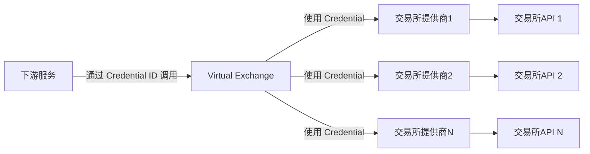

# 交易所对接代码规范

交易所对接，是指将一个新的交易所集成到现有的交易系统中，以便能够通过该系统与该交易所进行交易操作。以下是一些代码规范和最佳实践，旨在确保交易所对接的代码质量、可维护性和安全性。

核心架构:

- 交易所提供商 (Vendor): 负责与具体交易所的 API 进行交互，处理认证、请求和响应，负责包装接口，转换数据格式和语义。
- Virtual Exchange (VEX): 负责组合各个交易所提供商，向下游服务提供统一的交易所接口。负责管理接口凭证 Credential，路由请求到对应的交易所提供商。

可拓展性:

- 每个交易所对接作为一个独立的 Vendor 包进行开发和部署，遵循统一的接口规范，便于新增和维护。
- 每个 Vendor 无状态，不管理 Credential，可以水平扩展，支持多实例部署以应对高并发请求；支持多 IP 部署以应对交易所的限流要求；支持多 Credential 实例以支持多租户需求；支持多区域部署以降低网络延迟和异地容灾。
- VEX 无状态，可以水平拓展，支持多实例部署以应对高并发请求。

VEX 与 Vendor 之间的交互:

- Vendor 负责注册能力，提供元信息 (metadata)，描述它支持的接口和功能。
- VEX 负责根据下游服务的请求，动态调用 Vendor 提供的接口，进行请求路由、负载均衡和限流管理。

核心原则:

1. 集成 `@yuants/exchange` SDK，确保与交易所的交互符合统一的接口规范。
2. Vendor 无状态，不读写数据库，只翻译接口，永远不主动发起请求。但允许使用 `@yuants/cache` 进行本地缓存以提升性能。
3. 定义 credential 结构体，包含必要的认证信息，如 API Key、Secret Key 等。
4. 构建 Virtual Exchange，封装交易所的业务逻辑。下游服务调用 Virtual Exchange 提供的接口，而 Virtual Exchange 负责与实际交易所进行交互。



主要业务逻辑:

- 定义交易所的名字 (建议全大写，如 BINANCE、OKX、BITGET、HYPERLIQUID 等)。
- 定义 credential 结构体的 JSON Schema。以实现 credential 的自动路由和校验。
- 查询用户 ID (GetCredentialId)，要求全局唯一，建议使用 `encodePath(EXCHANGE_NAME, userId)`。
- 查询市场全量品种 (ListProducts)
- 获取账户全量持仓 (GetPositions)
- 订单 CRUD 操作 (下单、改单、撤单、查询订单)
  - 下单 (SubmitOrder)
  - 改单 (ModifyOrder)
  - 撤单 (CancelOrder)
  - 查询订单 (GetOrders)

## 品种 ID 规范

使用标准品种类型 `IProduct` (`@yuants/data-product`) 进行品种定义和管理，确保品种信息的统一性和准确性。

product_id: 保证全局唯一，支持通过 decodePath 进行解析，以便路由到对应的业务线 API 中。
建议格式：`encodePath(EXCHANGE_NAME, PRODUCT_TYPE, SYMBOL)`，例如 `BINANCE/USD-FUTURE/BTCUSDT`。

这很关键，后续各种业务逻辑都将基于 product_id 进行处理。

通过 product_id，可以获取规格、报价、历史数据，可以进行订单操作。

product_id 还可以用于限制查询持仓和订单的范围，确保只查询与该品种相关的 API，加速查询效率。例如 `getPositionsByProductId` 和 `getOrdersByProductId`。这在下游服务仅关注特定品种时非常有用。

(提案) 现货代币，位于同一 credential 的不同的账户 (资金账户、理财账户、交易账户) 中时，使用不同的 product_id 进行区分。例如 `BINANCE/FUNDING/USDT` 和 `BINANCE/SPOT/USDT`。后续划转将被建模为一次交易行为。

## Credential 管理规范

每个交易所对接 Vendor 必须定义 Credential 结构体，包含必要的认证信息，如 API Key、Secret Key 等。

使用 JSON Schema 定义 Credential 结构体，以便实现自动校验和路由。

✅ 通过 `@yuants/exchange` SDK 为 Credential 定义 JSON Schema。

🔐 Credentials 的加密持久化机制:

VEX 负责管理 Credential 实例，会通过 `@yuants/secret` 加密读写数据库，Credential 的实例永远不明文存储，防止脱库攻击。VEX 使用运行环境 (例如 Node Unit) 公钥加密 Credential。而私钥仅有运行环境持有，这个私钥永远不会存储在数据库中或者暴露于主机集群中。VEX 需要通过运行环境代理解密 (Secret Proxy Service) 才能将 Credentials 重新加载回内存。

❗️ 不处理 Credential 的过期和更新逻辑。大多数交易所的接口无法知晓 Credential 是否过期或者距离过期时间多远。Credential 的管理逻辑应由上层业务逻辑层实现，例如定期轮询测试 Credential 的有效性，并在发现 Credential 失效时，通知管理员更新。简而言之，Credential 过期，等同于一开始就配置了一个错误的 Credential。

⚠️ Credential 鉴权，通过 VEX 调用特定的接口 (例如 `GetPositions`)，如果返回鉴权错误，则认为 Credential 无效，或者没有查询持仓的权限。实际上我们不需要专门的鉴权接口，如果某个接口返回错误，结合错误信息判断，我们就认为有可能是鉴权失败。根据下文的错误处理规范，VEX 和 Vendor 都会原样传递交易所的错误信息给上层调用者。因此，我们没有专门设计的鉴权接口。

## L1 报价数据

Level-1 报价数据 (最新价、结算价、买一卖一价、24h 交易量、实时利率等) 是交易所对接的基础能力。

🚀 它关系到持仓中的现价、盈亏计算等等，用处非常多。

❗️ **然而，报价接口往往在各个交易所之间差异巨大**。

交易所的一个接口往往只能支持部分字段的查询，需要组合许多接口才能满足需求。
并且，来源多样，可能来自 REST API，也可能来自 WebSocket，甚至直接来源于持仓信息。

- ❌ 不能接受在交易所终端进行复杂的 combine 操作。
- ❌ 不能接受在交易所终端提前预热，并于后台持续拉取数据。
- ✅ 交易所终端只负责注册报价接口，并提供元信息 (metadata)，描述它支持的字段和品种规则。
- ✅ VEX 负责根据下游消费者的需求，动态调用这些接口，缓存和合并数据，提供统一的报价查询和订阅接口。

🎯 **规范需要简化对接难度，并且提供足够的灵活性。**

💡 解决方法：交易所对接终端注册能力，VEX 统一调度。

📒 交易所的接口，可以分为 query (request / response) 和 subscribe 两类。交易所会对这两类接口进行限流，因此，一个 IP 在同一时间内只能调用有限次数的 query 接口，或者订阅有限数量的 subscribe 接口。所以，标准要支持通过在不同 IP 上运行多个交易所终端实例来进行负载均衡，扩大容量。最终以覆盖所有需要的报价字段、提升实时性为目标。

给定一个需要查询 quote 的 product_id，交易所终端可能需要从 query 和 subscribe 两个维度进行处理：

假设交易所提供了 N 个 query 接口和 M 个 subscribe 接口，每个接口都支持部分字段的查询。交易所终端需要将这 N + M 个接口注册，以便 VEX 可以调用。VEX 负责缓存和合并这些接口的数据，以及二次分发。

📒 下游消费者可能有几种不同的需求:

总的来说，范围越大，鲜度要求越低；范围越小，鲜度要求越高。
永远不会获取穷尽全市场的报价数据，只会先列出关注的品种列表(尽管这个列表可能很大)，然后批量获取这些品种的一部分报价字段数据。

- 获取若干品种的若干字段 (要求所有字段的鲜度都在 t 秒内，例如 60 秒)。

  ```ts
  queryQuotes<K extends keyof IQuote>(product_ids: string[], fields: K[], t: number): Promise<Pick<IQuote, 'product_id' | K>[]>
  ```

- 订阅若干品种的若干字段 (持续推送，尽可能新鲜)。

  ```ts
  subscribeQuotes<K extends keyof IQuote>(product_ids: string[], fields: K[]): Observable<Pick<IQuote, 'product_id' | K>[]>
  ```

VEX 需要根据 product_ids 和 fields 来决定调用哪些 query 和 subscribe 接口，以满足下游消费者的需求。因此，这些接口的注册需要包含它们支持的字段列表。

每个报价接口需要提供 metadata，描述它支持的品种规则(product_id 前缀路径)和字段列表(数组)。而调用时，它需要指定一个 product_id (仅一个)。

🕒 数据鲜度:

1. IQuote 中的 updated_at 字段，表示该字段数据的时间戳 (毫秒级 Unix 时间戳)。VEX 会优先使用该字段来判断数据的鲜度；
2. 如果没有返回 updated_at 字段，总是认为它们返回的数据是当下最新的，VEX 会按照收到数据的时刻来定义鲜度。
3. 根据请求的鲜度要求 t，VEX 会决定是否需要调用 query 接口来刷新数据。

🧩 字段归一化 (Normalization)

问题：不同交易所对字段的定义不同（例如 volume 有的是基础货币成交量，有的是计价货币成交额）。 建议：

- 在 IQuote 定义中强制规范字段含义。
- 终端在 queryFn/subscribeFn 内部必须完成这个清洗 (Sanitization) 工作，确保 VEX 拿到的数据是标准化的。

```ts
interface IQueryQuoteService<K extends keyof IQuote> {
  type: 'query';
  metadata: {
    product_id_prefix_parts: string[]; // 例如 ["BINANCE", "USDT-FUTURE"]
    fields: K[];
  };
  queryFn: (product_id: string) => Promise<Pick<IQuote, 'product_id' | K>[]>;
}

interface IBatchQueryQuoteService<K extends keyof IQuote> {
  type: 'batch_query';
  metadata: {
    product_id_prefix_parts: string[]; // 例如 ["BINANCE", "USDT-FUTURE"]
    fields: K[];
    max_batch_size: number; // 最大批量查询数量
  };
  batchQueryFn: (product_ids: string[]) => Promise<Pick<IQuote, 'product_id' | K>[]>;
}

interface ISubscribeQuoteService<K extends keyof IQuote> {
  type: 'subscribe';
  metadata: {
    product_id_prefix_parts: string[]; // 例如 ["BINANCE", "USDT-FUTURE"]
    fields: K[];
  };
  // 必须确保当 Observable 被取消订阅时，终端向交易所发送相应的 Unsubscribe 消息或停止推送，防止资源泄漏。
  subscribeFn: (product_id: string) => Observable<Pick<IQuote, 'product_id' | K>[]>;
}
```

VEX 会提前收集所有报价接口的 metadata 信息，缓存在内存中，以便随时检查。

VEX 首先会维护下游消费者的订阅列表，规划需要调用的 subscribe 接口集合。如果某些字段无法通过 subscribe 接口获取，VEX 会退而求其次，使用循环调用 query 接口来定期刷新这些字段的数据。

对于特定品种的特定字段，VEX 保证只使用一个 Subscribe 接口对它进行订阅。出于鲁棒性考虑，避免 Subscribe 接口失常，所有字段都会使用 query 接口进行定期刷新。

💡 (提案) 匹配算法：对于请求 (product_ids, fields)，实现 O(ProductIds + Fields) 复杂度查询算法：

1. 对于每个 product_id，获取所有支持该 product_id 的接口 (提前建立 product_id_prefix -> 接口集合的 Trie 树)，得到候选接口集合 S_product_id。
2. 对于每个字段 field，获取所有支持该字段的接口（提前建立 field -> 接口集合的索引），得到候选接口集合 S_field。
3. 计算 S_product_id 与 S_field 的交集，得到最终候选接口集合 S_final。

排除不相关的接口，最终得到一个可用接口列表，这些接口通常全都有用。（因为交易所自己也不会提供两个功能重叠的接口，就算有我们也可以选择不接两个重复的，因此它不会是一个求最小覆盖问题，也没有接口之间的吸收问题）

VEX 需要检查缓存，然后并发调用/订阅这些接口，合并数据，并且维护缓存。

如果 VEX 发现某些字段无法通过任何接口获取，不会报错，而是返回 "" 空字符串，表示该字段不可用。

有时，报价接口会返回一类品种下很多品种的报价数据 (例如，返回所有现货代币的最新价)。这种情况下，VEX 会缓存这些数据，更新鲜度，并且在下游消费者请求这些品种的报价时，如果鲜度合适，直接从缓存中获取，而不需要再次调用接口。这意味着，交易所终端不需要特别声明某些接口是全量报价接口，VEX 会自动识别和利用这些接口。

## Rate Limit 与 负载均衡

交易所的限流规则通常非常复杂，是高频交易系统必须面对的现实问题。

### 限流的维度

1.  **IP 限制**: 针对来源 IP 的限制。通常用于公共数据接口 (Market Data)。
2.  **UID/API Key 限制**: 针对特定账户的限制。通常用于私有接口 (Order, Account)。
3.  **权重 (Weight/Cost)**: 不同接口消耗的额度不同。例如，查询最新价可能消耗 1 权重，而查询深度 (Orderbook) 可能消耗 50 权重。

### 终端职责

1.  **声明 Cost**: 在注册接口时，必须在 `metadata` 中声明该接口调用的静态权重消耗。
2.  **反馈状态**: 如果交易所通过 Response Header (如 `X-MBX-USED-WEIGHT`) 返回了当前消耗情况，终端应通过某种机制（如 Side-channel 或 扩展返回值）反馈给 VEX。
3.  **处理 429**: 当遇到 HTTP 429 (Too Many Requests) 错误时，终端必须捕获该错误，并明确告知 VEX 该实例已触发限流，以及需要等待的时间 (Retry-After)。

### VEX 调度策略

VEX 将所有连接的交易所终端实例视为一个 **资源池 (Resource Pool)**。

1.  **多实例聚合**: 用户可以在不同 IP 上部署多个交易所终端实例。VEX 会聚合这些实例的能力，形成一个总的 Rate Limit 资源池。
2.  **基于 Cost 的负载均衡**:
    - VEX 维护每个终端实例的 **剩余配额 (Quota)** 估算值。
    - 在分发请求时，优先选择剩余配额最多、负载最轻的实例。
    - 每次调度请求，从该实例的配额中扣除相应的 `cost`。
3.  **动态熔断与恢复**:
    - 一旦某个实例报告 429 错误，VEX 立即将该实例标记为 **“冷却中 (Cooldown)”**，暂停向其分发请求，直到冷却时间结束。
    - 流量会自动转移到其他健康的实例上。

### 接口定义更新

```ts
interface IQueryQuoteService<K extends keyof IQuote> {
  type: 'query';
  metadata: {
    product_id_prefix_parts: string[];
    fields: K[];
    cost: number; // 单次调用消耗的权重，默认为 1
  };
  queryFn: (product_id: string) => Promise<Pick<IQuote, 'product_id' | K>[]>;
}

interface IBatchQueryQuoteService<K extends keyof IQuote> {
  type: 'batch_query';
  metadata: {
    product_id_prefix_parts: string[];
    fields: K[];
    max_batch_size: number;
    cost: number; // 每次批量请求消耗的权重 (注意：有些交易所是按品种数计算，有些是按请求次数计算，需在此明确)
    // 建议定义为：基础消耗 + (品种数量 * 单位消耗) 的线性模型，或者简化为单次请求的固定消耗。
  };
  batchQueryFn: (product_ids: string[]) => Promise<Pick<IQuote, 'product_id' | K>[]>;
}
```

## 历史数据获取

目前，历史数据包括：

- ohlc (K 线)，对应类型 IOHLC (`@yuants/data-ohlc`)
- interest_rate (利率)，对应类型 IInterestRate (`@yuants/data-interest-rate`)
- trade (历史成交)，对应类型 ITrade (`@yuants/data-trade`)

核心目标:

将这些历史数据从交易所获取、清洗、全部写入数据库，供下游服务查询和使用。
历史数据通常价值较高，需要长期保存，且需要尽可能完整连续地获取。

客观挑战:

1. 交易所的数据接口的行为千差万别，**需要规范建模**。
2. 全量历史数据很多，不允许一次性或者短时间获取完毕，**必须支持增量获取**。
3. API 限流问题，需要允许多个交易所终端实例进行负载均衡。或者接受较慢的获取速度。(通常历史数据可以容忍这一点)

按照 "交易所对接终端注册能力，VEX 统一调度" 的架构设计，历史数据的调度逻辑放在 VEX 中实现，而交易所终端只负责提供简单数据获取接口，并负责清洗数据。

VEX 的目标:

1. 根据配置，自动发现需要获取历史数据的品种列表和账户列表。
2. 收集所有品种的 K 线 / 利率历史数据，并且持续更新最新数据。
3. 收集所有账户的历史成交数据，并且持续更新最新数据。
4. 合理调度，在保证限流的前提下，尽可能快地收集数据。

Vendor 的目标:

1. 注册历史数据接口，提供元信息 (metadata)，描述它支持的翻页方式和参数。
2. 提供历史数据获取函数 (fetchFn)，根据给定的参数，获取一页数据，并且清洗为标准格式。

VEX 收集历史数据时，是无状态的。它不会保存任何进度信息。
通常来说，历史数据最新的数据优先级最高，应该最先获取。

历史数据接口，通常都支持向前翻页获取更早的数据。但是，向前翻页所用的 cursor 不同，可能是时间戳 (timestamp)、也可能是 ID (id)。接口的行为还会涉及该 cursor 是否包含在结果集中 (inclusive / exclusive)。

VEX 调用接口获得一页数据时，需要观察接口的返回值，从中获得下一页的 cursor。

Inclusive vs Exclusive:

- Inclusive: 返回的数据包含 cursor 指定的时间点/ID/页码的数据。
- Exclusive: 返回的数据不包含 cursor 指定的时间点/ID/页码的数据。

如果不知道接口的行为，可以在开发阶段进行测试，观察返回结果，确定行为。

如果接口是 Exclusive 行为，VEX 直接使用返回的数据中的最后一个 cursor 获取下一页数据。
如果接口是 Inclusive 行为，VEX 需要在获取下一页数据时，调整 cursor，以避免重复数据。

**降级处理页码翻页接口**

按照页码翻页的接口，即便是同一个页码，随着时间的推移，数据内容也可能发生变化。因此，页码并不是一个可以持久化的 cursor，谈不上 Inclusive / Exclusive，它不支持通过已有的数据进行增量获取。但是仍然有一些改进的策略，例如二分法翻页，快速定位到需要的时间段，但这依然属于搜索的范畴，而不是直接的随机访问。调度搜索的逻辑，将会放在 VEX 中实现，交易所终端只负责提供翻页接口，并且提供 metadata，说明它是页码翻页。VEX 将额外维护搜索逻辑，进行小心地试探目标页码。

对于无法翻页的情况，可以认为只有一页数据。

1. 给定结束时间，向前获取一页数据
   - OKX 历史资金费率
   - OKX 历史杠杆利率
   - BINANCE 历史 K 线
   - BITGET 历史 K 线
   - OKX 历史 K 线
   - TQ, TradingView 历史 K 线
   - OKX 历史成交
2. 给定开始时间，向后获取一页数据
   - ASTER 历史资金费率
   - BINANCE 历史资金费率
   - BINANCE 历史杠杆利率
   - HYPERLIQUID 历史资金费率
   - OKX 历史资金费率
   - OKX 历史杠杆利率
   - OKX 历史成交
   - HYPERLIQUID 历史 K 线
3. 给定页码，向前获取一页数据
   - BITGET 历史资金费率
   - COINEX 历史资金费率
   - HTX 历史资金费率
4. 仅有一页数据
   - GATE 历史资金费率
5. 给定 ID，向前获取一页数据
   - OKX 历史成交
6. 给定 ID，向后获取一页数据
   - OKX 历史成交

## 错误处理规范

在与交易所交互的过程中，可能会遇到各种错误情况。为了确保系统的稳定性和可靠性，必须制定统一的错误处理规范。
可能遇到的错误类型包括但不限于网络错误、认证错误、请求参数错误、交易所返回的业务错误等。

核心原则:

1. 原样传递交易所错误: 交易所返回的错误信息应尽可能原样传递给上层调用者，保留错误代码和消息，便于诊断问题。无论是 Vendor 还是 VEX 都不应对错误信息进行修改或隐藏。根据 [error.md](./error.md) 中的规范，VEX 和 Vendor 都不是业务逻辑层，没有资格捕获、转换错误类型。
2. 保留调用参数上下文，特别是 Vendor 翻译接口时，需要保留发出请求的参数上下文，以及 VEX 调用参数上下文，便于排查是 Vendor 的问题还是 VEX 的问题，还是业务逻辑层的问题。

标准化错误类型，目前来说是否有必要还不确定，先保留交易所原始错误即可。
