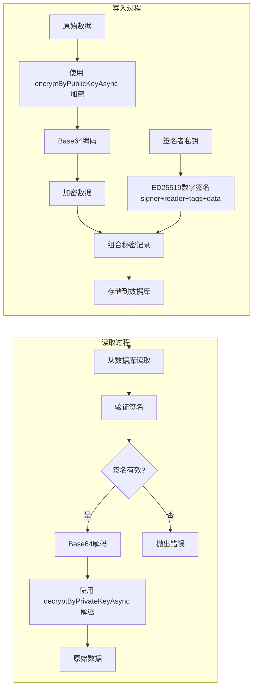
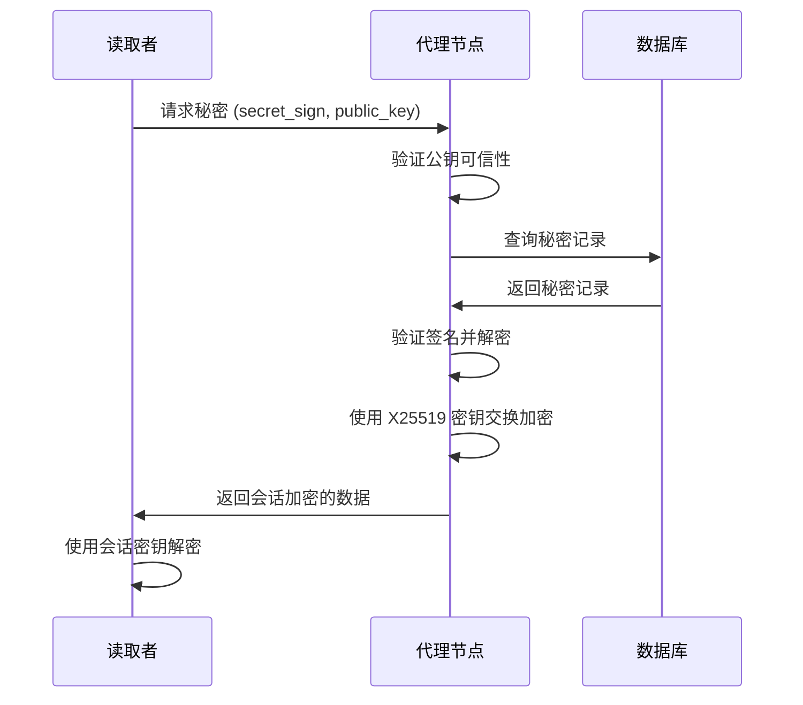

# @yuants/secret

`@yuants/secret` 是 Yuan 体系内的 secret 管理库，提供基于 Curve25519 公钥加密的分布式秘密存储和访问控制能力，适用于离线环境下的敏感数据持久化存储，允许提前指定读取者的 ED25519 公钥，并在读取者不在线的情况下完成非对称加密并持久化存储。而后，读取者可以在任何时间点使用其私钥解密获取秘密数据。

典型场景例如 API 密钥、模型代码等，需要无人监守地，由程序自行进行读取秘密。

- 秘密代理: 读取者可以作为代理，在不传递自身私钥的情况下，协助授权其他可信节点通过自身读取秘密数据。
- 安全存储: 秘密数据存储在 PostgreSQL 数据库中，支持长期保存和异步访问，即便数据库被脱库，秘密也不会被泄露。并且支持完整的索引以实现高效查询，支持通过明文 sign(签名), signer(签发者), reader(读取者) 或 tags 字典 匹配秘密数据记录。
- 数据完整性: 每个秘密数据记录都包含 ED25519 数字签名，用于验证数据完整性，防止篡改。

⚠️ 注意，如果您的场景可以保证加解密双方都在线，建议使用实时通讯加密以获得更高的前向安全性，参考 `@yuants/protocol` 中的 `terminal.security` 模块。

## 快速开始

```ts
import { Terminal } from '@yuants/protocol';
import { writeSecret, readSecret, setupSecretProxyService } from '@yuants/secret';

// 初始化终端
const terminal = Terminal.fromNodeEnv();

// 写入秘密
const secretData = new TextEncoder().encode('my-secret-api-key');
const secretRecord = await writeSecret(
  terminal,
  'reader-public-key', // 授权读取者的公钥
  { type: 'api-key', service: 'my-service' }, // 标签用于分类
  secretData,
);

// 读取秘密
const decryptedData = await readSecret(terminal, secretRecord);
const secretText = new TextDecoder().decode(decryptedData);
console.log('解密后的秘密:', secretText);
```

## 核心功能

### 1. 安全的秘密存储

- 使用混合加密方案保护敏感数据
- 每个秘密都包含 ED25519 数字签名验证完整性
- 支持标签化组织，便于分类和检索

### 2. 分布式秘密共享

- 支持跨节点的秘密读取
- 通过代理服务实现可信节点间的秘密传递
- 基于公钥白名单的访问控制

### 3. 持久化存储

- 秘密数据存储在 PostgreSQL 数据库中
- 支持长期保存和异步访问
- 完整的索引支持高效查询

## 技术原理

### 加密授权模型



### 加密机制

`@yuants/secret` 使用混合加密方案：

1. **签名验证**：使用 ED25519 算法对秘密记录进行数字签名，验证数据完整性
2. **数据加密**：通过 `@yuants/utils` 中的 `encryptByPublicKeyAsync` 和 `decryptByPrivateKeyAsync` 函数实现非对称加密
   - ED25519 与 Curve25519 同构，支持使用 ED25519 密钥进行加密操作
   - 使用 AES-GCM 对称加密处理大数据，非对称加密保护对称密钥

### 关键特性

- **离线工作**：无需密钥交换，直接使用公钥加密
- **前向保密**：每次加密使用不同的临时密钥对
- **高效加密**：使用对称加密处理大数据，非对称加密只处理密钥
- **完整性保护**：数字签名确保数据不被篡改

## 代理服务

`setupSecretProxyService` 提供了分布式秘密共享的核心能力，通过 X25519 密钥交换确保前向安全性。

### 工作原理

1. **服务注册**：在终端上注册 `ReadSecret/{public_key}` 服务
2. **可信验证**：维护可信公钥白名单，验证请求者身份
3. **密钥交换**：使用 X25519 进行密钥协商，生成会话密钥
4. **安全传输**：使用会话密钥加密传输数据

### 加密机制

代理服务使用 `terminal.security` 模块的密钥交换机制：

- **X25519 密钥交换**：代理节点与读取者进行 ECDH 密钥交换
- **会话密钥**：生成临时的对称会话密钥
- **前向安全**：每次会话使用不同的密钥，确保前向安全性

### 代理流程



### 安全特性

- **前向安全**：每次会话使用不同的 X25519 密钥对
- **可信公钥白名单**：只有可信节点才能请求代理服务
- **完整性验证**：代理过程仍然验证秘密签名
- **密钥交换**：使用 ECDH 协商会话密钥

### 应用场景

- **分布式系统**：在多个节点间安全共享配置
- **权限委托**：临时授权其他节点访问特定秘密
- **服务扩展**：新节点通过代理获取所需秘密

## 使用场景

**适用场景：**

- API 密钥、数据库密码等长期配置的存储
- 需要跨节点共享的敏感配置
- 离线环境下的秘密管理

**不适用场景：**

- 实时通讯数据加密（请使用 `terminal.security` 模块）
- 需要前向安全性的会话加密

## API 参考

### `writeSecret(terminal, reader, tags, secret, signer_private_key?)`

写入加密的秘密数据到数据库。

**参数：**

- `terminal` - Terminal 实例
- `reader` - 授权读取者的公钥
- `tags` - 标签对象，用于分类和检索
- `secret` - 要加密的秘密数据（Uint8Array）
- `signer_private_key` - 签名者私钥（可选，默认为 terminal.keyPair.private_key）

**返回值：** `Promise<ISecret>` - 加密后的秘密记录

### `readSecret(terminal, secret, reader_private_key?)`

读取并解密秘密数据。

**参数：**

- `terminal` - Terminal 实例
- `secret` - 要解密的秘密记录
- `reader_private_key` - 读取者私钥（可选，默认为 terminal.keyPair.private_key）

**返回值：** `Promise<Uint8Array>` - 解密后的原始数据

### `setupSecretProxyService(terminal, trusted_public_keys?)`

设置秘密代理服务，允许可信节点读取秘密。

**参数：**

- `terminal` - Terminal 实例
- `trusted_public_keys` - 可信公钥集合（可选）

**返回值：** `Set<string>` - 更新后的可信公钥集合

### `ISecret` 接口

定义秘密记录的数据结构：

```ts
interface ISecret {
  /** 数字签名（主键） */
  sign: string;
  /** 签名者公钥 */
  signer: string;
  /** 授权读取者公钥 */
  reader: string;
  /** 标签对象（JSONB） */
  tags: Record<string, string>;
  /** Base64 编码的加密数据 */
  data: string;
}
```

## 数据库结构

秘密存储在 PostgreSQL 的 `secret` 表中：

```sql
CREATE TABLE IF NOT EXISTS secret (
  "sign" TEXT PRIMARY KEY NOT NULL,      -- 数字签名
  signer TEXT NOT NULL,                  -- 签名者公钥
  reader TEXT NOT NULL,                  -- 授权读取者公钥
  tags JSONB NOT NULL,                   -- 标签对象
  "data" TEXT NOT NULL,                  -- Base64 编码的加密数据
  created_at TIMESTAMPTZ NOT NULL DEFAULT CURRENT_TIMESTAMP
);
```

## 安全说明

- 使用 ED25519 算法进行数字签名验证
- 通过 `@yuants/utils` 的加密函数保护数据
- 支持可信公钥白名单机制
- 数据在传输和存储过程中始终加密
- 每个秘密记录都经过完整性验证

## 依赖关系

- `@yuants/protocol` - 终端通信协议
- `@yuants/sql` - SQL 数据库操作
- `@yuants/utils` - 加密和工具函数
