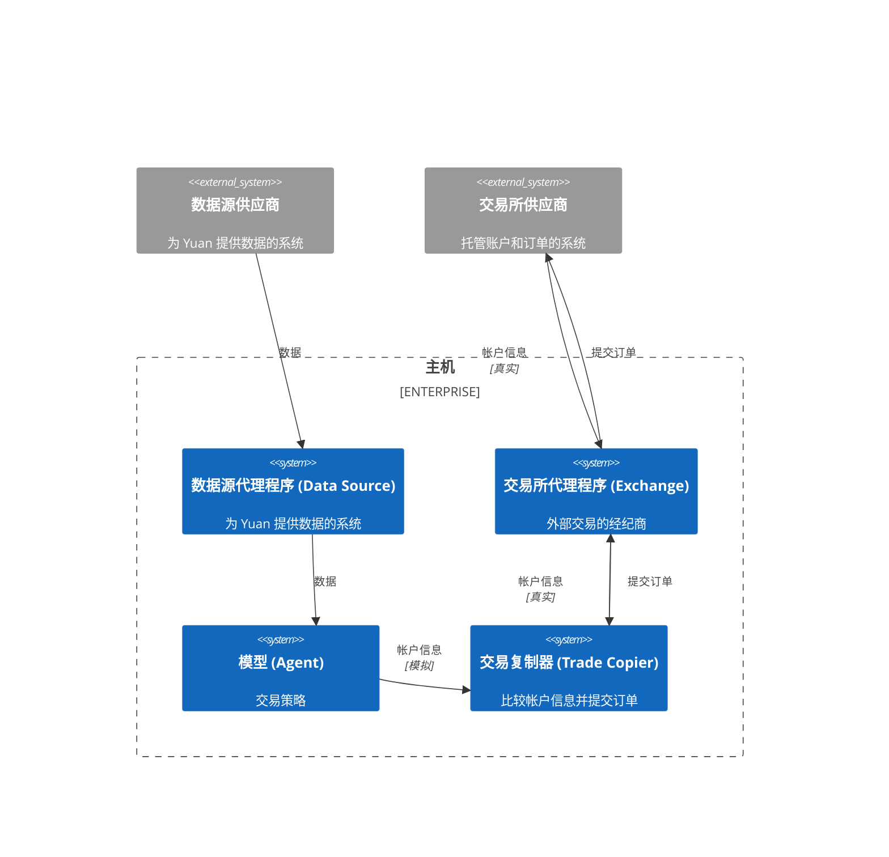

# 实盘交易

这是一个用于实盘交易的简单上下文图。

- Yuan 有用于统一数据源和交易所接口的代理程序 (Exchange)。
- 模型 (Agent) 不会直接向交易所 (Exchange) 提交订单，它将在内部模拟帐户。然后将模拟帐户发送给交易复制器 (Trade Copier)。
- 交易复制器 (Trade Copier) 将比较模拟帐户和真实帐户，并向交易所代理 (Exchange) 提交订单，以保持它们的帐户持仓一致。
- 交易复制器 (Trade Copier) 将等待订单完成。然后再次比较模拟帐户和真实帐户。如果持仓不一致，它将再次提交订单。
- 这种架构至少有数十毫秒的延迟，因此不适用于高频交易[^1]，但非常适用于投资组合，而且非常稳健。额外的延迟可能来自与外部系统的网络。

## 延伸阅读

你可以在 [GitHub](https://github.com/No-Trade-No-Life/Yuan/tree/main/apps/trade-copier) 上找到更多关于交易复制器的信息。

[^1]: 注意，高频交易的最佳解决方案是将模型、数据源和交易所经纪商集成到一个专用程序中。并将其尽可能靠近交易所部署。以便延迟可以降低到小于 1 毫秒。关键点是减少所有不必要的处理。目前 Yuan 暂时不适合高频交易。但我们将尽力在将来改进。
