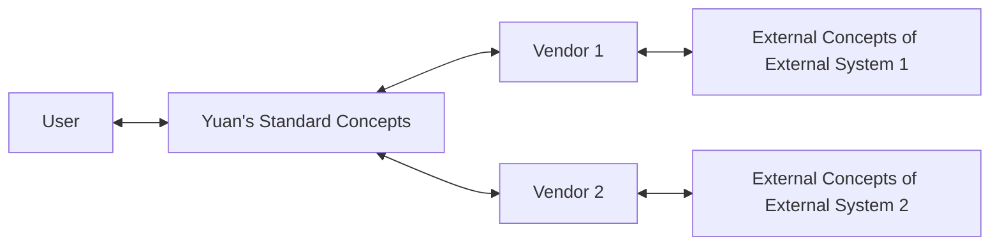

Today, you can see a wide array of exchanges and data sources worldwide, each with its own unique API and ecosystem. Learning to use them and integrating them into an automated process is quite laborious.

An **External System** refers to data providers, exchanges, or other entities that are not part of Yuan.
A **Vendor** acts as an intermediary between Yuan and external systems.

A **Standard** is a set of concepts, rules, guidelines, and characteristics designed to ensure consistent concepts among vendors and control the quality of vendor implementations.
We aim to establish a unified standard applicable to all global markets, enabling investors to interact with any market by learning just this one standard.

### Does the Standard Exist?

The fact is, we haven't heard of such a standard existing, which means it either hasn't been created yet or isn't well-known enough for us to be aware of it.

There are two possibilities for the absence of a standard: first, it may never exist; second, it simply doesn't exist yet.

A standard can be seen as a highly condensed abstraction of all vendor instances. If the information entropy of these instances is sufficiently high, it will be impossible to abstract a useful standard. No matter the level of standardization, it won't reduce the cognitive cost of learning these instances. In such cases, even if a standard is established, there's no point in learning it.

If an ultimate standard exists, we can always strive to find it.

<!-- Deduction:

The industry is very new and still booming, with new things constantly being created, and information flow is insufficient. There are many new opportunities within the industry, and those creating these new things might not notice some existing advanced solutions due to the urgency of business development, leading them to reinvent the wheel. This results in a rather chaotic state for the industry.

During its development, our standard will be accepted as a local standard for a long time until the industry becomes very mature. -->

### Why Us?

1. We, NTNL, are a free alliance of traders, representing the interests of traders;
2. We do not have a specific stance on external systems;
3. We do not have as many legal and compliance responsibilities as external systems;

### Concept Consistency

When we talk about certain terms and concepts, they should be consistent and unambiguous for all vendors.

The standard concepts defined by Yuan and the external concepts defined by external systems will inevitably differ. Vendors, playing the role of connecting external systems with Yuan, will need to convert standard concepts into external concepts.

After learning the standard concepts, users theoretically do not need to understand the internal terminology differences of each vendor to seamlessly and fully utilize the entire system. Conversely, if standard concepts do not successfully isolate external concepts, users must understand the external concepts of relevant external systems. Facing a large and complex system, it is difficult for users to comprehensively understand the external concepts of each external system. Even if they do, if the external system changes, all relevant users need to update their knowledge. This is a high-cost endeavor. In software engineering, using the "principle of least knowledge" for "encapsulation" to isolate changes and system boundaries has many benefits. This is analogous to the scenario we are discussing.

The fact is, different external systems are made by different people with different purposes, terminologies, and levels of openness.
Not only is there no unity between markets with different cultural and national backgrounds, but even among emerging cryptocurrency exchanges, there is no unity.

The view is that from the perspective of external systems themselves, there is no intrinsic motivation for them to unify standards. This is because the responsibility of external systems is to make their own systems better, improving efficiency and quality. From a professional standpoint, unifying concepts is not the responsibility of external systems. External systems will not consider accommodating standards unless there are suitable standards and accommodating them is beneficial to themselves.

The fact is, there have been several attempts at standardization. For example, the CME Group in the USA, the CTP system in China's futures market, the FIX protocol in foreign exchange systems, global broker IBKR, the unified trading library CCXT for cryptocurrencies, and the full-chain interoperability protocol in blockchain.

The view is that these attempts at unification have made some progress, but they are all partial, not rigorous, or do not aim to become an open standard. Currently, the overall situation is fragmented, with some local unity. Investors, or capital, have the mobility to move to markets where they can more easily multiply. However, investors and capital cannot easily cross the barriers between unified markets, which are usually political, and sometimes technical. These barriers, in general, create a state of stasis. This mobility and stasis form a contradiction. If there is a good standard, it will enhance the mobility of investors, weaken the technical barriers between markets, but have no impact on the political barriers between markets. Local protectionism in markets will not be disrupted. Overall, this is an improvement to the current system, not a revolution.

If we want to achieve the goal where users can completely ignore the concepts of each external system, our standard must be the union of all external concepts to have complete expressiveness. Otherwise, our standard will have unfulfillable tasks, forcing users to learn the concepts of external systems, and our goal will fail.

However, blindly taking the union may lead to an overabundance of standard concepts. The standard should also remain concise, not become bloated.

A negative example is CCXT, which has somewhat unified the public interfaces of all exchanges but failed by compromising on some non-standard interfaces, allowing users to penetrate and call specific exchange interfaces through CCXT. This inevitably requires users to have some understanding of the concepts of specific exchanges while using CCXT. This undermines the benefits brought by the standard itself. When we integrated with CCXT, we found that it could not completely isolate the knowledge of specific exchanges. Ultimately, its positioning is as a code library, and its responsibility is to simplify the process of users calling specific exchanges. It only does part of the work, so I assert that it will not become a standard in the future.

If a vendor is defined as an application rather than a code library, the situation would be very different. "Developers calling a code library" and "users interacting with an application" are similar in form but different in content.

For example, the user's purpose might be "monitoring account information to detect anomalies," "pulling all data to study patterns," "executing order operations to change account positions," and so on, without caring whether it's by polling interfaces or subscribing to sockets. They only care about the possibility and effectiveness of achieving their goals, not the means of implementation. Therefore, the standard needs to be appropriately and assertively constructed according to the user's purpose.

Different user purposes will have different requirements for the timeliness and accuracy of data interaction.

1. Research: No requirement for timeliness, but high requirement for accuracy. After all, a small error can lead to a big mistake.
2. Monitoring: Basic requirement for timeliness, acceptable within a few seconds, as the purpose is to allow human intervention, and human intervention cannot be that fast. Therefore, further increasing timeliness beyond human reaction capabilities is meaningless. There is also a certain tolerance for accuracy, as humans can tolerate some false alarms.
3. Execution: High requirement for timeliness, low requirement for data accuracy, as the accuracy of the execution environment is limited by the accuracy of the original data source and must have automatic fault tolerance and correction capabilities.

Additionally, computational resources and data scale will also affect engineering design, but these are not dimensions that need to be considered in defining standard concepts. Because computational power is limited, we only need to define standard concepts based on the user's purpose.

### Summary

Concept consistency is a crucial principle of the standard.

With concept consistency, subsequent quality control and security can become automated aspects. The definition of these aspects, we consider introducing separately.

With concept consistency, traders can truly no longer need to learn the concepts of each external system individually.
