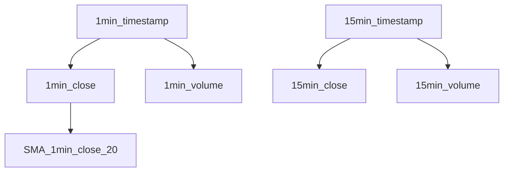

# Using Time Series

**Time Series** is an important part of Quantitative Trading Analysis.

In fundamental, time series is an array of number, which is aligned to the timestamp series.

- Every time series has a UUID, which is used to identify the time series.
- Every time series has a name, which is used to label the time series.
- Every time series has a parent series. The root of time series is inferred as timestamp series.
- Every time series has some attribute tags for other usages.

## Time Alignment and Time Series Forest

In fact:

- Every item of time series has two conceptual dimension: time and value.
- Most of time series share a same time dimension.
- Sometimes, we need to analyze in cross time frames. (e.g. both in 1hour and 1day time frames)

To resolve this issue, let's introduce the Time Series Forest[^1], which is a tree structure that contains all the time series.

[^1]: Forest is a computer science term. It's a data structure of a collection of trees.



The roots of the tree are timestamp series. Timestamp is represented as number timestamp epoch in milliseconds.

The children of the timestamp series are the time series that are aligned to the timestamp series.
For example, the close price series is aligned to the timestamp series. So the root series of close price series is the timestamp series.

There're might be multiple time series that are aligned to the same timestamp series. For example, the close price series and the volume series are both aligned to the timestamp series.

There're might be multiple timestamp series. For example, the timestamp series of 1-minute and the timestamp series of 15-minute.

## Time Direction and Time Series Index

The value of time series can be random-accessed by index, because it's an array. The index makes sense only in the context of time alignment.

The array grows from left to right, which means the index of the latest item is the largest.

The index of the latest item is called the **current index**, it's usually the bar that has not closed.
The previous number of the current index is called the **previous index**, it's usually the bar that has closed.

```ts
export default () => {
  const { time, open, close } = useOHLC('Y', 'XAUUSD', 'PT1H');
  console.info(
    formatTime(time.currentValue), // the latest time, equivalent to time[time.length - 1]
    time.currentIndex, // equivalent to time.length - 1
    time.previousIndex, // equivalent to time.length - 2
    close.currentIndex, // equivalent to time.currentIndex
    open.currentValue, // the latest open price, equivalent to open[open.currentIndex]
    open.previousValue, // the previous open price, equivalent to open[previousIndex]
    close.currentValue, // the latest close price, equivalent to close[currentIndex]
    close.previousValue, // the previous close price, equivalent to close[previousIndex]
  );
};
```

## `useSeries`

`useSeries` is used to create a Time Series.

- The first parameter is the name of the series.
- The second parameter is the parent series.
- The third parameter is the tags of the series. Defaults to `{}`

```ts
export default () => {
  const { close } = useOHLC('Y', 'XAUUSD', 'PT1H');
  const series = useSeries('series-name', close);
  useEffect(() => {
    series[series.currentIndex] = Math.random();
  });
};
```

You can also specify the tags to initialize the Series.

```ts
export default () => {
  const { close } = useOHLC('Y', 'XAUUSD', 'PT1H');
  const series = useSeries('series-name', close, { display: 'line', chart: 'new' });
  useEffect(() => {
    series[series.currentIndex] = Math.random();
  });
};
```

## Visualization

You can specify the third parameter of `useSeries` to control the visualization.

You can specify the display type of the series.

- It will hide the series by default.
- You can draw line chart by specify `display: 'line'`.
- You can draw histogram by specify `display: 'hist'`.

You can specify which chart to place the series.

- It will place the series follow the parent series by default.
- You can place the series on a new chart by specify `chart: 'new'`.
- You can place the series follow another series by specify `chart: anotherSeries.id`.
