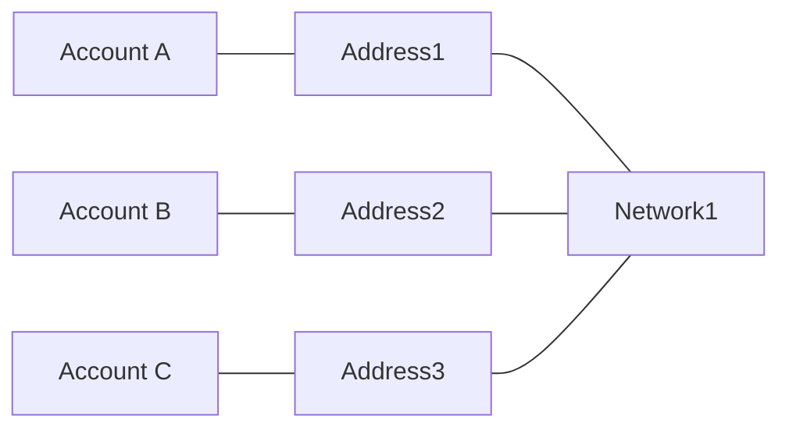
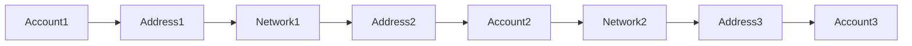
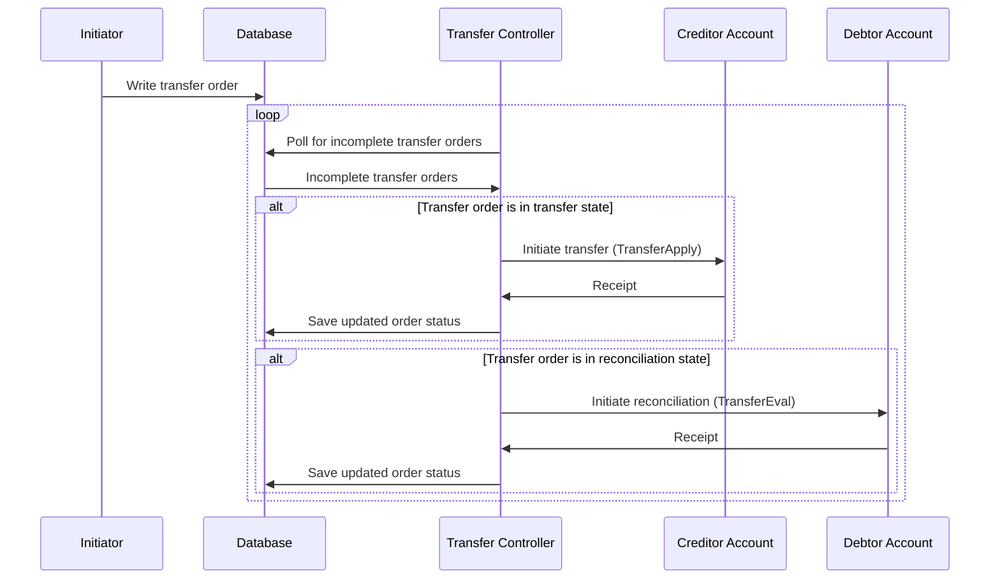

# Transfer

Transfer refers to the process of moving a specified amount of a designated currency from a **creditor account** to a **debtor account**.

- **Supports** direct transfers between accounts within the same network. For example: transferring USDT on the ERC20 network to another USDT on the ERC20 network.
- **Supports** automatic routing for the same currency across different networks. For example: transferring USDT on the ERC20 network to USDT on the TRC20 network.
- **Does not support** transfers between different currencies, which requires a trade. For example: transferring USDT to BTC.

A **Transfer Order** is used to describe the specific details of a transfer, including its purpose and status.

When initiating a transfer order, at least the **four essential elements** must be specified: creditor account, debtor account, currency name, and transfer amount.

## Execution of Transfers and Transfer Networks

If two accounts are within the same transfer network, they can directly transfer funds to each other. Examples include SWIFT, ACH, Wise, UnionPay, AliPay, and Blockchain.

A transfer network consists of three elements:

- **Network**: An abstract concept identified by `network_id`, used to distinguish different transfer networks. The internal workings of the transfer network do not need to be concerned with.
- **Address**: The recipient address within the network, identified by `address`, which always belongs to a specific network.
- **Account**: An account consists of multiple addresses belonging to various networks, allowing deposits and withdrawals from these addresses.

**Basic assumption of transfer networks: Any two addresses within the same network can transfer funds to each other.**

A real transfer network might look like the following diagram, where red dots represent networks, blue dots represent accounts, and green dots represent addresses.

:::note[Graph Theory Perspective]
From a graph theory perspective, the transferability between all addresses within the same network forms a complete graph.
This complete graph can be equivalently represented as edges from all nodes to a virtual super node.
:::

If funds cannot be directly transferred from the creditor account to the debtor account, a series of intermediate accounts must be used as intermediaries to complete the transfer through various transfer methods.

A transfer requires planning a path from the transfer network graph to serve as the flow path for the funds.

We need to introduce a **Transfer Controller** to oversee the execution of the transfer process. Additionally, a **database** is required to persist the transfer order status, ensuring that either party can resume the order after recovering from an unavailable state.

### Account Terminal

- During initialization, write **Account Address Info** into storage.
- Implement "Transfer" (`TransferApply`) and "Reconciliation" (`TransferEval`) interfaces for each network.
- The transfer interface initiates a transfer and returns the result synchronously.
  - The initial state of the transfer is `INIT`.
  - Only one step is performed at a time, returning the next state, which can be customized and polled by the controller.
  - If an exception occurs and it is not a special error, the controller is allowed to retry the poll.
  - After the transfer initiation process is complete, return `COMPLETE`.
  - If an unrecoverable exception occurs, return `ERROR`.
- The reconciliation interface queries and confirms whether a specific transfer has been received, returning the result synchronously.
- Does not handle writing the transfer order status into storage. (This logic is delegated to the controller to simplify the process)

### Transfer Controller

Implemented by `@yuants/app-transfer-controller`, it can be deployed directly.

- Does not handle creating transfer orders, only updating them.
- Monitors new transfer orders; if there is no planned path, it plans a transfer path for the process and writes it into storage. (Manual optimization of this planning result is allowed)
- According to the planned transfer path, sends transfer and reconciliation instructions sequentially to the accounts along the path to ensure the smooth execution of the entire process.
- When the transfer or reconciliation interface returns `ERROR`, it determines that recovery through retries is not possible and requires manual intervention, initiating an alarm.
- Initiates an alarm when the entire transfer process times out.

### Account Address Info

**Account Address Info** is the information that needs to be written into the database during the initialization of the account terminal.

| Field Name   | Description   | Example Value      |
| ------------ | ------------- | ------------------ |
| `network_id` | Network ID    | `"ERC20"`          |
| `address`    | Address ID    | `"0x123456"`       |
| `account_id` | Account ID    | `"VENDOR/USER_ID"` |
| `currency`   | Currency Name | `"USDT"`           |

### Transfer Network Info

**Transfer Network Info** is information that needs to be manually written into the database.

| Field Name   | Description   | Example Value |
| ------------ | ------------- | ------------- |
| `network_id` | Network ID    | `"ERC20"`     |
| `currency`   | Currency Name | `"USDT"`      |
| `commission` | Estimated Fee | `20`          |
