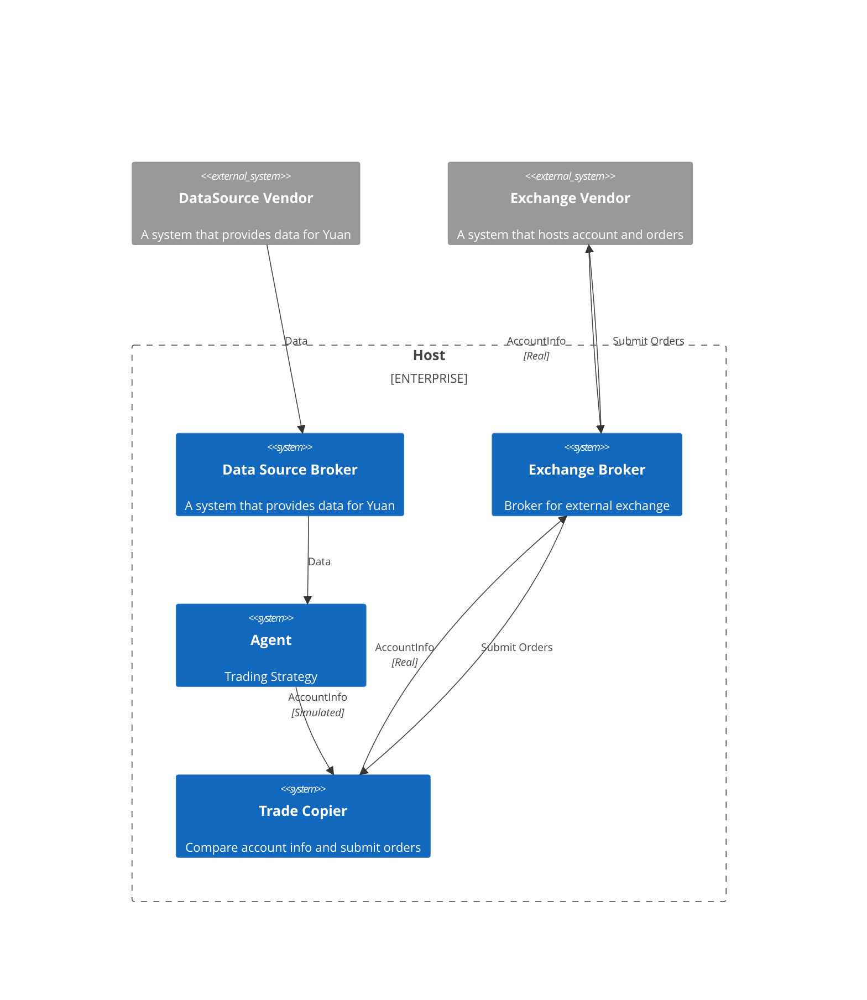

# What is Yuan

## Real world trading

It's a simple context diagram for real world trading.

- Yuan have broker programs for unify data source and exchange interfaces.
- Agent will not submit orders to exchange directly, it will simulate accounts internally. And then send the simulated accounts to Trade Copier.
- Trade Copier will compare the simulated accounts and real accounts, and submit orders to exchange broker. In order to keep their account positions consistent.
- Trade Copier will wait for the order to be finished. And then compare the simulated accounts and real accounts again. If the positions are not consistent, it will submit orders again.
- This architecture has at least tens of ms latency, So it's not suitable for high frequency trading[^1], but it's very easy to do portfolio and very robust. Extra latency may comes from network with external systems.

## Further Reading

You can find more information about Trade Copier in [GitHub](https://github.com/No-Trade-No-Life/Yuan/tree/main/apps/trade-copier).

[^1]: Note the best solutions for high frequency trading is to cohere the agent, data source and exchange brokers in one dedicated program. And deploy it as close as possible to the exchange. So that the latency can be reduced to less than 1ms. The key-point is to reduce all the no need processing. Yuan is temporarily not suitable for high frequency trading. But we will try to improve it in the future.
