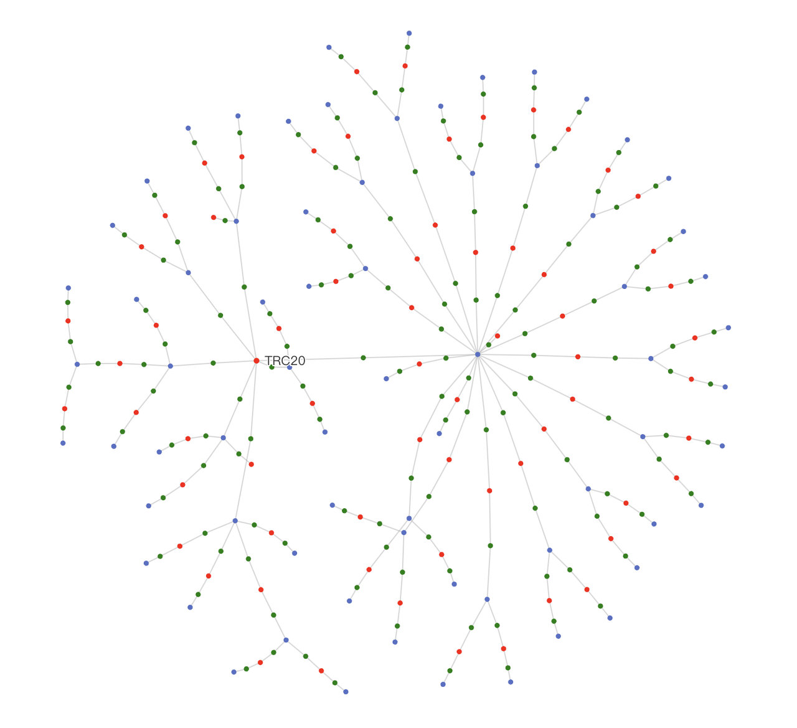
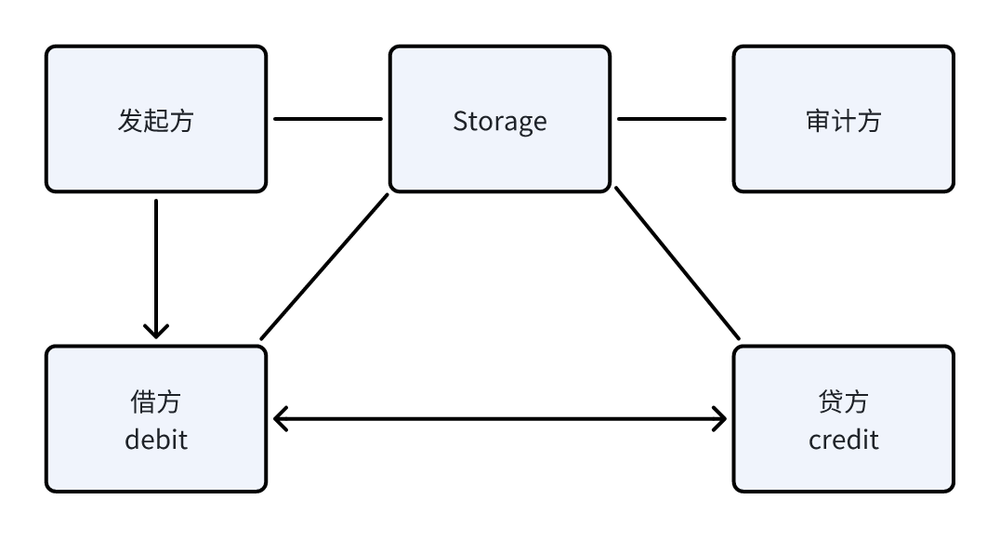

# Provide Transfer Interface

Venders are responsible for implementing the transfer interface, which is used for transferring funds between accounts.

## Transfer Order

**Transfer Order (TransferOrder)**, a transfer order defines the basic information of the transfer, including the account IDs of both parties, the transfer amount, the transfer status, etc.

The fields in the transfer order are divided into purpose and execution categories. The purpose fields are the basic information of the transfer order; the execution fields are intermediate status information in the transfer process, used to record the status during the transfer process.

The transfer order is initiated and filled by any third party with the purpose-related fields and written into the database, and is handled by a dedicated **Transfer Controller** component responsible for the execution of the transfer process.

Funds cannot directly move from the creditor's account to the debtor's account; they need to go through a series of intermediate accounts as intermediaries and different transfer methods to complete the transfer process. The accounts and the different transfer methods between accounts (such as TRX on-chain transfer, main account/sub-account transfer of an exchange) form a graph structure called the **Transfer Network**. A specific transfer is to plan a path in the graph as the flow path of the funds.



### Complete Transaction Order Fields

```ts
/**
 * ITransferOrder represents the transfer order, will be updated by both sides during the transfer process
 *
 * ITransferOrder indicates the transfer order, which will be updated by both sides during the transfer process
 *
 * @public
 */
export interface ITransferOrder {
  /**
   * Order ID
   *
   * Order ID
   */
  order_id: string;
  /**
   * Created Timestamp
   *
   * Created timestamp
   */
  created_at: number;
  /**
   * Updated Timestamp
   *
   * Last updated timestamp
   */
  updated_at: number;
  /**
   * Credit Account ID
   *
   * Creditor's account ID (payer)
   */
  credit_account_id: string;
  /**
   * Debit Account ID
   *
   * Debtor's account ID (payee)
   */
  debit_account_id: string;
  /**
   * Currency
   *
   * Transfer currency
   */
  currency: string;
  /**
   * Expected Amount
   *
   * Expected transfer amount
   */
  expected_amount: number;
  /**
   * Order Status
   *
   * - `"COMPLETE"` - Transfer completed
   * - `"ERROR"` - Transfer failed, need to check the error message, need human intervention
   * - `"ONGOING"` - Transfer is pending, need to wait
   */
  status: string;
  /**
   * Error Message for Human-reading
   *
   * Human-readable error message
   */
  error_message?: string;

  /**
   * Transfer path (encoded as (AccountId | Address | NetworkId)[] using encodePath)
   * Not using foreign keys but saving inline as historical records
   */
  routing_path?: {
    /** Initiating transfer account ID */
    tx_account_id?: string;
    /** Receiving transfer account ID */
    rx_account_id?: string;
    /** Initiating transfer address */
    tx_address?: string;
    /** Receiving transfer address */
    rx_address?: string;
    /** Network ID */
    network_id?: string;
  }[];

  /**
   * Current processing transfer path index
   */
  current_routing_index?: number;

  /** Current initiating transfer account ID */
  current_tx_account_id?: string;
  /** Current receiving transfer account ID */
  current_rx_account_id?: string;
  /** Current initiating transfer address */
  current_tx_address?: string;
  /** Current receiving transfer address */
  current_rx_address?: string;
  /** Current network ID */
  current_network_id?: string;
  /** Current transfer state (INIT -> ...? -> COMPLETE), ERROR */
  current_tx_state?: string;
  /** Current transfer transaction id */
  current_transaction_id?: string;
  /** Current transfer state context for state flow */
  current_tx_context?: string;
  /** Current receiving state (INIT -> ...? -> COMPLETE), ERROR */
  current_rx_state?: string;
  /** Current receiving state context for state flow */
  current_rx_context?: string;
  /** Current transfer start time */
  current_step_started_at?: number;

  /** Current transfer amount */
  current_amount?: number;
}
```

## Transfer Procedure

The transfer occurs between the debtor's and creditor's accounts, with the purpose of transferring the balance from the creditor's account to the debtor's account.

- The transfer order is initiated by the initiating party and completed after multiple interactions between both parties.

- The transfer is an operation with low latency requirements but extremely high accuracy requirements.

- The transfer order status needs to be persisted in Storage to ensure that either party can continue to complete the order after recovering from an unavailable state.

- In principle, any side effects on the order need to be actively and promptly updated to Storage by the updating party.

- Timeout errors are detected by a permanent auditing party.



The specific algorithm is as follows:

- The initiating party creates a transfer order (ITransferOrder), writes the order ID, the account IDs of both parties, the transfer amount, the timeout, and notifies the debtor;

- The debtor adds the transfer method candidate list and notifies the creditor;

- The creditor initiates the transfer based on its own situation, updates the creditor's transfer method, the timestamp of the transfer initiation, the amount, and notifies the debtor.

- The debtor polls its own order flow until it finds this order credited, the specific matching rules depend on the situation (can be by ID or amount or note), and updates the order status to completed.

- Note, if the debtor has multiple accounts, the debtor needs to ensure that the balance is transferred to the correct account when the order is completed.

## Vendor Implementation

The transfer interface consists of two APIs, namely transfer request and transfer query.

Suppliers need to implement the current transfer step's transfer request and transfer query based on the execution fields in the transfer order.

```ts
interface IService {
  // Initiate transfer
  TransferApply: {
    req: ITransferOrder;
    res: IResponse<{ state: string; context?: string; transaction_id?: string; message?: string }>;
    frame: void;
  };
  // Verify transfer (reconciliation)
  TransferEval: {
    req: ITransferOrder;
    res: IResponse<{ state: string; context?: string; received_amount?: number } | void>;
    frame: void;
  };
}
```

### Example: Understanding the Underlying Implementation of Transfer

The transfer request is used to initiate the transfer operation. Suppliers need to implement the current transfer step's transfer request based on the execution fields in the transfer order.

Generally, a vendor instance may provide multiple accounts and various different transfer methods, so it is necessary to determine which logical branch the current transfer should go to based on the execution fields in the specific transfer order. The following example simply demonstrates this point.

:::warning
Please note that the following example is for demonstrating the underlying logic only, and the actual implementation of the transfer interface should use the tool library we provide.
:::

```ts
import { ITerminal } from '@yuants/protocol';

const terminal = new ITerminal(process.env.HOST_URL!, {});

const contextList = [
  {
    account_id: '1',
    currency: 'USDT',
    network_id: 'AccountInternal/1/SubAccount/1',
    address: 'main',
  },
  {
    account_id: '2',
    currency: 'USDT',
    network_id: 'TRC20',
    address: '0x1234567890',
  },
];

terminal.provideService(
  'TransferApply',
  {
    type: 'object',
    required: ['current_tx_account_id', 'currency', 'current_network_id', 'current_tx_address'],
    oneOf: contextList.map((x) => ({
      properties: {
        current_tx_account_id: {
          const: x.account_id,
        },
        currency: {
          const: x.currency,
        },
        current_network_id: {
          const: x.network_id,
        },
        current_tx_address: {
          const: x.address,
        },
      },
    })),
  },
  async (req) => {
    const { current_tx_account_id, currency, current_network_id, current_tx_address, current_tx_state } = req;
    if (
      current_tx_account_id === '1' &&
      currency === 'USDT' &&
      current_network_id === 'AccountInternal/1/SubAccount/1' &&
      current_tx_address === 'main'
    ) {
      if (current_tx_state === 'INIT') {
        /// NOTE: makeSubAccountParams and Api.transferSubAccount need to be implemented by yourself
        const params = makeSubAccountParams(order);
        const transferResult = await Api.transferSubAccount(params);
        if (!transferResult.success) {
          return { state: 'INIT', message: transferResult.message };
        }
        return { state: 'COMPLETE' };
      }
      return { res: { code: 400, message: 'Unknown State', data: { state: 'ERROR' } } };
    } else if (
      current_tx_account_id === '2' &&
      currency === 'USDT' &&
      current_network_id === 'TRC20' &&
      current_tx_address === '0x1234567890'
    ) {
      if (current_tx_state === 'INIT') {
        /// NOTE: makeTRC20Params and Api.transferTRC20 need to be implemented by yourself
        const params = makeTRC20Params(order);
        const transferResult = await Api.transferTRC20(params);
        if (!transferResult.success) {
          return { state: 'INIT', message: transferResult.message };
        }
        const withdrawId = transferResult.withdrawId;
        return { state: 'AWAIT_TX_ID', context: withdrawId };
      }
      if (current_tx_state === 'AWAIT_TX_ID') {
        const withdrawId = order.current_tx_context;
        const withdrawHistoryResult = await Api.getWithdrawHistory(withdrawId);
        const transactionId = withdrawHistoryResult?.transactionId;
        if (!transactionId) {
          return { state: 'AWAIT_TX_ID', context: withdrawId };
        }
        return { state: 'COMPLETE', transaction_id: transactionId };
      }
      return { res: { code: 400, message: 'Unknown State', data: { state: 'ERROR' } } };
    }
    return { state: 'COMPLETE' };
  },
);

terminal.provideService(
  'TransferEval',
  {
    type: 'object',
    required: ['current_rx_account_id', 'currency', 'current_network_id', 'current_rx_address'],
    oneOf: contextList.map((x) => ({
      properties: {
        current_rx_account_id: {
          const: x.account_id,
        },
        currency: {
          const: x.currency,
        },
        current_network_id: {
          const: x.network_id,
        },
        current_rx_address: {
          const: x.address,
        },
      },
    })),
  },
  async (req) => {
    const { current_rx_account_id, currency, current_network_id, current_rx_address, current_rx_state } = req;
    if (
      current_rx_account_id === '1' &&
      currency === 'USDT' &&
      current_network_id === 'AccountInternal/1/SubAccount/1' &&
      current_rx_address === 'main'
    ) {
      return { state: 'COMPLETE' };
    }
    if (
      current_rx_account_id === '2' &&
      currency === 'USDT' &&
      current_network_id === 'TRC20' &&
      current_rx_address === '0x1234567890'
    ) {
      /// NOTE: makeCheckTRC20Params and Api.checkTRC20 need to be implemented by yourself
      const params = makeCheckTRC20Params(order);
      const checkResult = await Api.checkTRC20(params);
      if (!checkResult.success) {
        return { state: 'INIT', message: checkResult.message };
      }
      const received_amount = checkResult.receivedAmount;
      return { state: 'COMPLETE', received_amount };
    }
    return { state: 'COMPLETE' };
  },
);
```

### Example: Implementing Transfer Interface via Tool Library

From the above example, we can see that the logic between different accounts and transfer methods is independent, so we provide a tool library to implement the specific transfer process using the (`account ID`, `network ID`, `currency`, `address`) quadruple as the Key.

To address the above issues, for maintainability considerations, we provide a tool library to assist in implementing the transfer interface.

Its API is:

```ts
export const addAccountTransferAddress = (ctx: {
  terminal: ITerminal;
  account_id: string;
  currency: string;
  network_id: string;
  address: string;
  onApply: Record<
    string,
    (order: ITransferOrder) => Promise<{
      state: string;
      context?: string;
      transaction_id?: string;
      message?: string
    }
  >,
  onEval: (order: ITransferOrder) => Promise<{
    state: string;
    context?: string;
    received_amount?: number
  }>;
}) => void;
```

:::info
The following example describes our recommended transfer implementation method. For a more complete example, see: [OKX Transfer](https://github.com/No-Trade-No-Life/Yuan/blob/4dc37b9c30292a2fd87a311cca3d06f9e53e4f2d/apps/vendor-okx/src/index.ts#L521).
:::

```ts
import { ITerminal, addAccountTransferAddress } from '@yuants/protocol';
import { ITransferOrder } from '@yuants/data-model';

const terminal = new ITerminal(process.env.HOST_URL!, {});

addAccountTransferAddress({
  terminal,
  account_id: '1',
  currency: 'USDT',
  network_id: 'AccountInternal/1/SubAccount/1',
  address: 'main',
  onApply: {
    INIT: async (order: ITransferOrder) => {
      /// NOTE: makeSubAccountParams and Api.transferSubAccount need to be implemented by yourself
      const params = makeSubAccountParams(order);
      const transferResult = await Api.transferSubAccount(params);
      if (!transferResult.success) {
        /// NOTE: All states other than COMPLETE/ERROR will be sent back to the current step's executor by the transfer controller, such as returning INIT here, the transfer controller will set the transfer order's status to INIT and resend it to the current vendor's step to execute until success or transfer timeout.
        return { state: 'INIT', message: transferResult.message };
      }
      return { state: 'COMPLETE' };
    },
  },
  /// NOTE: For this type of transfer, we believe it will be completed immediately, so we directly return COMPLETE here
  onEval: async (order: ITransferOrder) => {
    return { state: 'COMPLETE' };
  },
});

addAccountTransferAddress({
  terminal,
  account_id: '2',
  currency: 'USDT',
  network_id: 'TRC20',
  address: '0x123456789',
  onApply: {
    INIT: async (order: ITransferOrder) => {
      /// NOTE: makeTRC20Params and Api.transferTRC20 need to be implemented by yourself
      const params = makeCheckTRC20Params(order);
      const transferResult = await Api.transferTRC20(params);
      if (!transferResult.success) {
        return { state: 'INIT', message: transferResult.message };
      }
      const withdrawId = transferResult.withdrawId;
      /// NOTE: Sometimes the transfer cannot be completed immediately, such as TRC20 transfer needing to wait for on-chain confirmation,
      ///   until the on-chain Transaction ID is obtained, we consider the transfer step to be over,
      ///   at this time, it is necessary to let the current transfer step enter a new state (any name, here we name it AWAIT_TX_ID) and return a context information,
      ///   afterwards, the transfer controller will save this context information in the transfer order's current_tx_context field and resend it to the current vendor's corresponding step to execute.
      return { state: 'AWAIT_TX_ID', context: withdrawId };
    },
    AWAIT_TX_ID: async (order: ITransferOrder) => {
      const withdrawId = order.current_tx_context;
      /// NOTE: Api.getWithdrawHistory needs to be implemented by yourself
      const withdrawHistoryResult = await Api.getWithdrawHistory(withdrawId);
      const transaction_id = withdrawHistoryResult?.transactionId;
      if (!transaction_id) {
        return { state: 'AWAIT_TX_ID', context: withdrawId };
      }
      return { state: 'COMPLETE', transaction_id };
    },
  },
  onEval: async (order: ITransferOrder) => {
    /// NOTE: makeCheckTRC20Params and Api.checkTRC20 need to be implemented by yourself
    const params = makeCheckTRC20Params(order);
    const checkResult = await Api.checkTRC20(params);
    if (!checkResult.success) {
      return { state: 'INIT', message: checkResult.message };
    }
    const received_amount = checkResult.receivedAmount;
    return { state: 'COMPLETE', received_amount };
  },
});
```
