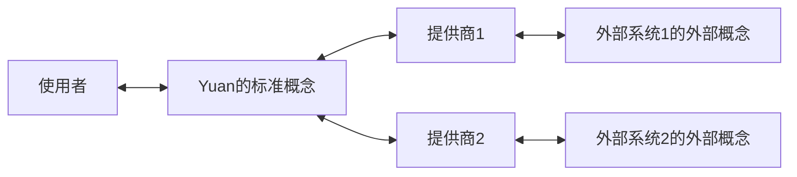

如今，你可以看到全世界琳琅满目的交易所、数据源，他们都有着各自不同的 API、生态系统。学习使用它们并将其纳入一种自动化的流程是一件非常费力的事。

外部系统 (External System) 是指不属于 Yuan 的数据提供商、交易所或者其他实体。
而提供商 (Vendor) 是指 Yuan 和外部系统的中介。

标准是一组概念、规则、指南和特性，用于确保提供商的概念一致，并控制提供商的实现质量。
我们希望建立一套适用于全球所有市场的统一标准，使得投资者仅仅需要学习这套标准即可与所有市场交互。

### 标准存在吗？

事实是，我们没有听说这个标准存在，这意味着它目前还没有产生，或者足够有名以至于我们知道它。

现在没有可用的标准有两种可能，第一，它永远不会有；第二，它现在还没有。

标准可以看作是一个所有提供商实例的高度凝练的抽象，如果实例的信息熵足够高，那么将不可能抽象出什么有用的标准。无论建立何种程度的标准，都不能降低我们认知实例的学习成本。这种情况下，就算建立了标准，也没有去学习它的意义。

如果有一个最终的标准存在，那么我们总是可以努力去把它找出来。

<!-- 演绎：

行业非常新，还在蓬勃的发展，新的事物一直在被创造，并且信息的流通是不充分的。行业内存在大量的新机会，而创造这些这些新的东西的人，他可能不会注意到现有的一些较为先进的东西，反而会因为业务发展的紧迫性而自己造轮子，从而使得整个这个行业处在一个较为混沌的状态。

在发展的过程中，我们的标准会在很长一段时间内作为一个局部的标准，被人们所接受，直到这个行业变得非常成熟。 -->

### 为什么是我们？

1. 我们 NTNL 是一个交易者的自由联盟，代表交易者们的利益；
2. 我们不具有特定的外部系统的立场；
3. 我们没有外部系统那么多的法律合规责任；

### 概念一致性

当我们谈及一些术语、概念时，这应当是对于所有的提供商都是一致的，无歧义的。

Yuan 定义的标准概念，与外部系统定义的外部概念之间，一定存在差异。而提供商，扮演着将外部系统与 Yuan 连接的角色，就势必需要将标准概念与外部概念进行转换。

使用者学习了标准概念之后，理论上就无需去了解每个提供商内部的术语差异，即可丝滑地、完整地利用整个系统。反之，如果标准概念没有成功隔离掉外部概念，那么使用者就必须理解相关的外部系统的外部概念。面对一个庞大复杂的系统，使用者是很难去全面地了解每个外部系统的外部概念的。就算了解了，如果外部系统发生了变化，所有的相关使用者都需要去更新自己的知识。这是一件总成本很大的事情。在软件工程中，利用 “最小知识原则” 进行 “封装”，以隔离变化，隔离系统边界，有诸多好处。这就与我们所讨论的这个场景如出一辙。

事实是，不同的外部系统是不同的人制作的，目的不一，术语不一，对外开放程度不一。
不仅是具备不同文化背景、国家背景的市场之间没有统一，就连新兴的虚拟货币交易所，彼此之间都没有统一。

观点是，站在外部系统自身的角度来看，它是没有统一标准的内生动机的。这是因为，外部系统自身的职责就是将自身的系统做好，提升效率、提升质量。出于专业化的考量，统一概念并非外部系统的责任。外部系统不会考虑去迎合标准，除非有适合的标准且迎合标准是对自身有利的。

事实是，也已经出现过若干标准化的尝试。例如美国的 CME Group、中国期货市场的 CTP 系统、外汇系统的 FIX 协议、全球级别的券商 IBKR、虚拟货币的统一交易库 CCXT、以及区块链中的全链互操作性协议。

观点是，这些统一的尝试都具有一定的进步性，然而他们都是局部的、不严密的、或者说无心成为一个开放标准的。当下来看，整体是分裂的，局部是统一的。投资者，或者说资本，有着像更容易增殖的市场迁移的运动性。但投资者和资本又无法轻易跨过统一市场之间的障碍，这种障碍通常是政治性的，也有技术性的，总的来说构成了一种静止性。这种运动性就和静止性构成了一组矛盾。如果有一个好的标准，会使得投资者的运动性得到增强，削弱市场之间的技术性障碍，但对市场之间的政治性障碍没有影响。市场的局部保护主义不会受到破坏。总的来说，这是一种对现行体系的改良，而非革命。

如果我们想要达成使用者可以完全忽略各个外部系统的概念的目标，我们的标准就必须取所有外部概念的并集，以获得完整的表达力。否则，我们的标准就存在无法完成的任务，使得使用者被迫去学习外部系统的概念，我们的目标就失败了。

然而，一味地取并集，可能会导致标准概念的泛滥。标准同时应该保持精简，而不是变得臃肿。

一个反面的典型是 CCXT，它一定程度上对所有交易所公共的接口做了统一标准，但败笔在于它为一些非标准的接口做了妥协，允许用户通过 CCXT 穿透性地调用具体交易所的接口。这势必导致用户在使用 CCXT 的同时还对具体交易所的概念有一定的了解。这破坏了标准本身带来的好处。我们在接入 CCXT 的时候，发现通过它并不能完全隔离掉具体交易所的知识。归根结底，它的定位是一个代码库，它的职责是简化用户调用具体交易所的过程。它只做了部分工作，所以我断言，它未来也不可能会变成一个标准。

如果提供商被定义为一个应用，而不是一个代码库，情况就会大不一样。“开发者调用代码库”和“用户与应用交互”，在形式上是相似的，但在内容上是不同的。

例如，用户的目的是 “监控账户信息以发现异常”、“拉取全部数据以研究其中的规律”、“执行订单操作以改变账户头寸” 等等，而不会关心是轮询接口还是订阅套接字。他们仅仅关心达成目的的可能性和效果，而不会关心达成目的背后的实现手段。因此，标准需要针对用户的目的进行适当地、有主见地建设。

根据用户目的的不同，会对数据交互的实时性和准确性有不同的要求。

1. 研究：对实时性无要求，但对准确性有高要求。毕竟失之毫厘，谬以千里。
2. 监控：对实时性有基本要求，在几秒内都可以接受，因为目的是让人能够介入，人的介入不可能那么快，因此将实时性进一步做高，超越人的反应能力时，是没有意义的。对准确性也有一定的容忍度，因为人可以允许有一定的误报。
3. 执行：对实时性要求高，对数据的准确性要求不高，因为受限于原始数据源的准确性，执行环境必须有自动容错纠错能力。

另外，算力资源和数据规模也会影响工程设计，但不是建立标准概念需要关心的维度。因为，计算能力是有极限的。我们仅仅需要从使用者的目的，来定义标准概念即可。

### 小结

概念一致性是标准的重要原则和底线。

有了概念一致性，后续的质量控制、安全性才能成为一个可以自动实施的切面。这些切面的定义，我们考虑另作介绍。

有了概念一致性，交易者们才能真正地不再需要逐个学习每个外部系统的概念。

<!-- ### 质量控制

在概念一致性的前提下，我们才可以模拟用户对提供商的服务进行统一的自动测试和度量。用于评估不同的提供商的实现表现。

1. 定性测试：编写测试用例，基本保证提供商的代码以符合预期的方式运行，其结果只有通过和不通过。同时辅助定义标准的行为，辅助进行回归测试。
2. 定量评测：编写度量用例，在实验室环境下，评测提供商的表现。并且可以对比不同提供商的表现。
3. 跟踪反馈：编写跟踪用例，跟踪在真实的环境下的表现。为提供商的进一步改良提供数据依据。

由于外部系统的存在，针对提供商的测试和度量不可能是无副作用的。因此执行持续测试，是有较大的成本的。例如需要测试下单的用例，就一定会产生真实的交易，从而产生交易费用。因此，我们仅在有必要的时机执行定性测试和定量评测，例如在正式版本发布时执行。但是跟踪反馈是可以一直随行的。

全量/部分测试：在开发时，只需要触发相关的测试用例即可。仅在必要的时机执行全量的测试。 -->
