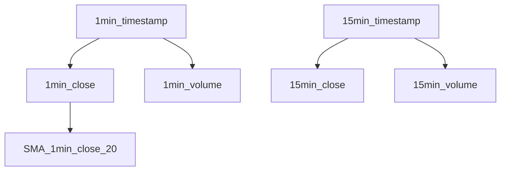

# 使用时间序列

**时间序列** 是量化交易分析的重要组成部分。

在基本层面上，时间序列是一个数字数组，与时间戳序列对齐。

- 每个时间序列都有一个 UUID，用于标识时间序列。
- 每个时间序列都有一个名称，用于标记时间序列。
- 每个时间序列都有一个父序列。时间序列的根被推断为时间戳序列。
- 每个时间序列都有一些属性标签，用于其他用途。

## 时间对齐和时间序列森林

事实上：

- 时间序列的每个项目都有两个概念维度：时间和值。
- 大多数时间序列共享相同的时间维度。
- 有时，我们需要在交叉时间框架中进行分析。（例如，在 1 小时和 1 天时间框架中）

为了解决这个问题，我们引入了时间序列森林[^1]，它是一个包含所有时间序列的树结构。

[^1]: 森林是计算机科学术语。它是一种由树集合组成的数据结构。



树的根是时间戳序列。时间戳以毫秒为单位的时间戳纪元表示。

时间戳序列的子节点是与时间戳序列对齐的时间序列。例如，收盘价序列与时间戳序列对齐。因此，收盘价序列的根序列是时间戳序列。

可能有多个时间序列与相同的时间戳序列对齐。例如，收盘价序列和成交量序列都与时间戳序列对齐。

可能有多个时间戳序列。例如，1 分钟的时间戳序列和 15 分钟的时间戳序列。

## 时间方向和时间序列索引

时间序列的值可以通过索引随机访问，因为它是一个数组。索引只有在时间对齐的上下文中才有意义。

数组从左到右增长，这意味着最新项目的索引最大。

最新项目的索引称为**当前索引**，通常是尚未关闭的柱。当前索引的前一个数字称为**前一个索引**，通常是已关闭的柱。

```ts
export default () => {
  const { time, open, close } = useOHLC('Y', 'XAUUSD', 'PT1H');
  console.info(
    formatTime(time.currentValue), // 最新时间，等同于 time[time.length - 1]
    time.currentIndex, // 等同于 time.length - 1
    time.previousIndex, // 等同于 time.length - 2
    close.currentIndex, // 等同于 time.currentIndex
    open.currentValue, // 最新开盘价，等同于 open[open.currentIndex]
    open.previousValue, // 前一个开盘价，等同于 open[previousIndex]
    close.currentValue, // 最新收盘价，等同于 close[currentIndex]
    close.previousValue, // 前一个收盘价，等同于 close[previousIndex]
  );
};
```

## `useSeries`

`useSeries` 用于创建时间序列。

- 第一个参数是序列的名称。
- 第二个参数是父序列。
- 第三个参数是序列的标签。默认为 `{}`

```ts
export default () => {
  const { close } = useOHLC('Y', 'XAUUSD', 'PT1H');
  const series = useSeries('series-name', close);
  useEffect(() => {
    series[series.currentIndex] = Math.random();
  });
};
```

您还可以指定标签来初始化序列。

```ts
export default () => {
  const { close } = useOHLC('Y', 'XAUUSD', 'PT1H');
  const series = useSeries('series-name', close, { display: 'line', chart: 'new' });
  useEffect(() => {
    series[series.currentIndex] = Math.random();
  });
};
```

## 可视化

您可以指定 `useSeries` 的第三个参数来控制可视化。

您可以指定序列的显示类型。

- 默认情况下会隐藏序列。
- 您可以通过指定 `display: 'line'` 来绘制折线图。
- 您可以通过指定 `display: 'hist'` 来绘制直方图。

您可以指定将序列放置在哪个图表上。

- 默认情况下，序列会跟随父序列放置。
- 您可以通过指定 `chart: 'new'` 将序列放置在新图表上。
- 您可以通过指定 `chart: anotherSeries.id` 将序列跟随另一个序列放置。
