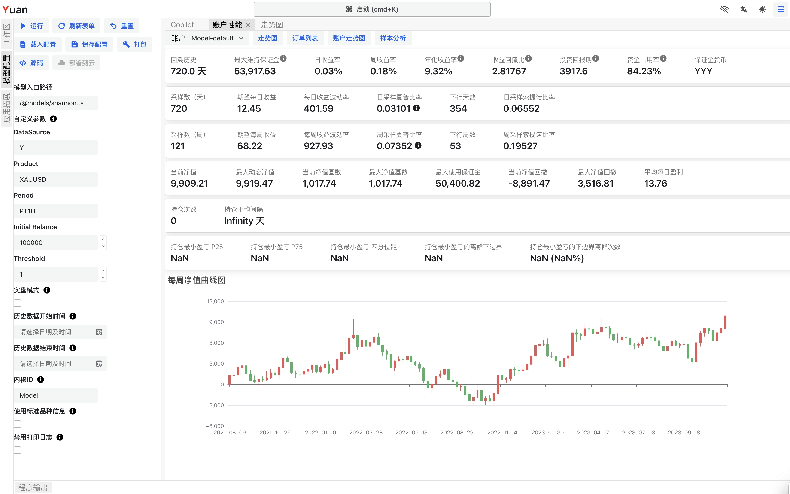
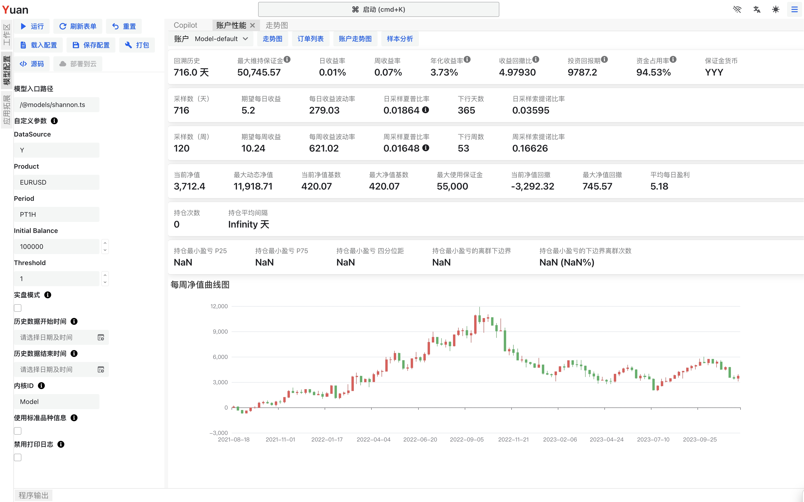

# 创建你的第一个策略

[克劳德·艾尔伍德·香农 (Claude Elwood Shannon)](https://en.wikipedia.org/wiki/Claude_Shannon) 是一位美国数学家、电气工程师和密码学家，被誉为“信息论之父”。他发现了一种简单的投资策略，可以用来在市场立于不败之地。这个策略被称为 _香农再平衡_，_香农之魔_ 或 _香农无限网格_。

关键思想是定期重新平衡你的投资组合。重新平衡是通过卖出价值增长的资产并购买价值下降的资产来完成的。

这个策略非常容易理解和实施。让我们详细介绍这个策略。

一个经典的例子是保持 50% 的现金和 50% 的仓位。

例如，如果你有 1000 美元投资黄金。你可以购买 500 美元的黄金并保留 500 美元的现金。
始终重新评估黄金和货币的价值，如果需要的话进行重新平衡，保持 50% 的黄金和 50% 的现金。
如果黄金价格上涨，你卖出一些黄金以保持平衡。
如果黄金价格下跌，你购买黄金以保持平衡。
从长远来看，即使黄金价格没有上涨，通过重新平衡仍然可以获利。

让我们在以下章节中看看如何实施和测试这个策略。

## 打开你的工作空间

首先，打开你的工作空间。如果你还没有工作空间，请创建一个。

如果你在桌面设备上访问 Yuan，请按照以下步骤操作：

1. 在主页上点击 "打开工作空间..." 按钮。
2. 阅读隐私声明并点击 "同意并继续" 按钮。
3. 选择一个本地文件夹作为你的工作空间文件夹。建议使用一个空文件夹。
4. 确认导入示例项目，这是为了导入使用工具函数的必要步骤。
5. 点击左侧面板上的 "资源管理器"，你将看到工作空间文件夹（就是你在步骤 3 中选择的文件夹）。
6. 现在你可以在工作空间文件夹中找到一些文件夹和文件。
7. 完成！我们将在这个工作空间中进行工作。

如果你是从移动设备访问网站（或者找不到 "打开工作空间" 按钮），你的设备不支持打开本地文件夹，请按照以下步骤操作：

1. 点击左侧面板上的 "资源管理器"，你将看到工作空间文件夹。默认情况下是空的。
2. 在资源管理器面板顶部点击 "导入示例" 按钮。这是导入一些工具的重要步骤。
3. 现在你可以在工作空间文件夹中找到一些文件夹和文件。
4. 完成！我们将在这个工作空间中进行工作。

## 创建一个新的模型 (Agent)

在 Yuan 中，交易策略被称为 "模型 (Agent)"。让我们创建一个新的模型。

1. 在资源管理器面板中，点击根文件夹的 "..." 按钮。
2. 点击 "创建文件" 按钮。
3. 输入文件名为 `shannon.ts`（或者你喜欢的任何其他名称，但文件扩展名必须是 `.ts`）。
4. 现在你可以在资源管理器面板中看到新文件 `shannon.ts`。
5. 点击 `shannon.ts` 文件的 "..." 按钮。
6. 点击 "编辑器" 按钮，这样我们就可以打开一个编辑器。
7. 完成！我们将在这个编辑器中编写代码。

:::tip
你也可以使用你喜欢的编辑器（例如 VSCode）来编辑文件。Yuan 将检测文件变更并自动重新加载模型。
:::

## Hello World 时间！

现在，让我们在编辑器中编写代码。以下代码是模型的基本框架。

```ts
export default () => {
  console.info('Hello World!');
};
```

1. 在 `shannon.ts`` 文件的 "..." 按钮上点击鼠标。
2. 点击 "运行" 按钮，这样我们就可以打开模型配置表单。
3. 这是一个复杂的表单，但我们现在可以忽略它。只需点击 "运行" 按钮。
4. 瞬间，你可以在页面顶部看到 "运行完成" 的消息，并显示了 "账户性能" 面板。
5. 打开页面底部的 "程序输出" 面板，你可以找到 "Hello World!" 的消息（可能还有其他无关的消息）。
6. "账户性能" 现在应该是空的，因为我们还没有进行任何交易。
7. 干得好！我们已经运行了我们的第一个模型。

:::info
你可以在 [Guide - Agent](/docs/category/guide---agent) 部分找到有关模型的更多详细信息。
:::

## 实现策略

:::info
你可以在你的工作空间的 `/@models/shannon.ts` 中找到完整的代码。
如果编写程序对你来说比较困难，你可以直接使用它并跳过这一部分。
:::

现在，让我们逐步实现这个策略。

### 获取数据

```ts
export default () => {
  // 定义模型的参数
  const datasource_id = useParamString('DataSource', 'Y');
  const product_id = useParamString('Product');
  const period = useParamString('Period', 'PT1H');
  // 获取品种信息和价格数据
  const product = useProduct(datasource_id, product_id);
  const { close } = useOHLC(datasource_id, product_id, period);
};
```

1. 我们使用 `useParamString` 从模型配置表单中获取参数。

   你可以在点击 "模型配置" 面板顶部的 "刷新" 按钮后，在 "模型配置" 表单中找到这个参数。

2. 我们使用 `useProduct` 获取品种信息。

   产品的详细信息可以在 _[什么是品种](/docs/basics/what-is-product)_ 中找到。

3. 我们使用 `useOHLC` 获取价格数据。我们现在只需要 `close` 价格。

   变量 `close` 是一系列价格数据。它几乎是一个数字数组。

   'PT1H' 是价格数据的周期。它表示 1 小时。这是 [ISO 8601 Duration](https://en.wikipedia.org/wiki/ISO_8601#Durations) 的字符串格式。

   一些其他例子：'PT1M' 表示 1 分钟，'PT15M' 表示 15 分钟，'P1D' 表示 1 天，'P1W' 表示 1 周。

按照以下步骤重新运行代码：

1. 打开页面左侧的 "模型配置" 面板。
2. 点击 "模型配置" 面板顶部的 "刷新" 按钮。
3. 你可以在 "模型参数" 部分找到上述定义的参数。
4. 你可以看到参数的一些默认值。如果你喜欢，可以更改它们。
5. 在 "Product" 参数中填写 `XAUUSD`。这是黄金的产品 ID。
6. 点击 "模型配置" 面板顶部的 "运行" 按钮。
7. 很快，你会看到一个新的 "账户表现" 面板。
8. "账户表现" 面板中仍然是空值，因为我们还没有进行任何交易。
9. 点击 "账户表现" 面板顶部的 "技术图表" 按钮。
10. 你现在可以看到黄金的价格图表。
11. 完成！我们已经获取了数据。

### 构建策略

我们需要监控价格，计算预期持有的头寸。如果预期头寸与实际头寸的误差足够大，我们可以进行重新平衡。

1. 定义 **初始余额** 和 **误差阈值** 作为参数，这样你可以在不改变代码的情况下调整它们。
2. 使用 API `useAccountInfo` 获取账户信息。这样我们可以获取账户的权益。
3. 使用 API `useSimplePositionManager` 获取当前头寸并设置目标头寸。这是一个简单的头寸管理器。它将执行订单操作，将你的头寸移动到目标数量。对于一些简单的策略来说，这非常有用。
4. 定义 **总价值** 是权益和初始余额的总和。因为账户的初始权益是零。Yuan 允许账户有负权益以显示策略的更多细节。
5. 头寸的总价值是总价值的一半。因为我们想保持 50% 货币和 50% 头寸。
6. 我们可以从头寸的总价值和产品的价格推断要持有的头寸量。
7. 计算预期头寸量与实际头寸的误差率。
8. 如果误差率足够大，设置目标数量。
9. 注意，头寸量有一个最小步长（`volume_step`）。我们需要将订单数量 (Order Volume) 舍入到这个步长。
10. 每小时使用 `useEffect` Hook 检查上述内容，将第二个参数设置为 `[close.length]`。

```ts
import { useSimplePositionManager } from '@libs';
export default () => {
  // ...
  // 更多参数
  const initial_balance = useParamNumber('Initial Balance', 100_000);
  const threshold = useParamNumber('Threshold', 1);
  // 获取账户信息
  const accountInfo = useAccountInfo();
  // 使用单一头寸管理器
  const [actualVolume, setVolume] = useSimplePositionManager(accountInfo.account_id, product_id);
  // 重新平衡头寸
  useEffect(() => {
    if (close.length < 2) return;
    const price = close[close.length - 1];
    const totalValue = accountInfo.money.equity + initial_balance;
    const totalValueToHold = totalValue * 0.5;
    // 推断要持有的头寸量
    const valuePerVolume =
      price * (product.value_speed ?? 1) * (product.is_underlying_base_currency ? -1 / price : 1);
    const expectedVolume = totalValueToHold / valuePerVolume;
    // 计算误差率
    const volume_step = product.volume_step ?? 1;
    const errorRate = Math.abs((actualVolume - expectedVolume) / volume_step);
    if (errorRate > threshold) {
      setVolume(roundToStep(expectedVolume, volume_step));
    }
  }, [close.length]);
};
```

## 回测策略

我们已经完成了模型代码。现在，让我们回测这个策略。

1. 在 "Product" 参数中填写 `XAUUSD`。这是黄金美元的品种 ID。
2. 点击 "模型配置" 面板顶部的 "运行" 按钮。
3. 很快，你会看到一个新的 "账户性能" 面板。
4. 完成！我们已经在黄金品种上回测了这个策略。



你也可以在其他产品上回测这个策略。例如，你可以在 `EURUSD` 品种上回测这个策略。



- 你可以点击 "账户性能" 面板顶部的 "技术图表" 按钮查看这个策略的交易详情。
- 你可以点击 "账户性能" 面板顶部的 "订单列表" 按钮查看这个策略的订单列表。
- 如果你想将这个策略部署到实盘，你可以点击 "模型配置" 面板顶部的 "部署到云" 按钮。

## 延伸阅读

在你的工作空间的 `/@models` 文件夹中有一些其他的例子，你可以从中学到更多。

如果你想更深入地了解 Yuan，请阅读 [Guide - Agent](/docs/category/guide---agent) 部分。

:::warning[免责声明]
这些材料仅为信息目的而准备，不构成对任何投资的建议或处置，也不涉及任何特定的投资策略。这些材料包含一般信息，未经定制为任何特定的接收方或接收方。这些材料中显示或使用的信息或数据是从据信可靠的来源获取的，但其准确性不能得到保证。
:::
