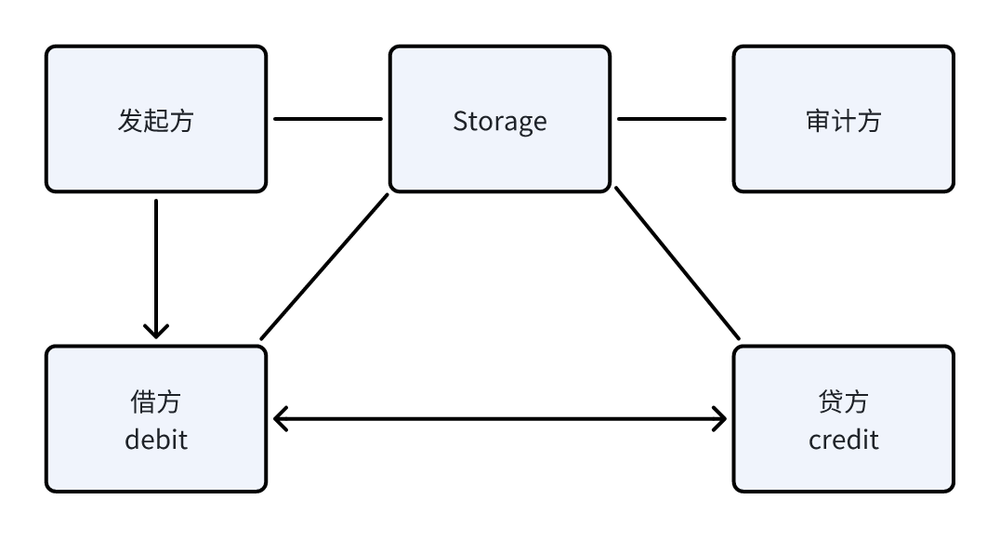

# 提供转账接口

供应商负责实现转账接口，用于账户之间的转账操作。

## 转账订单

**转账订单 (TransferOrder)**，转账订单定义了转账的基本信息，包括转账双方的账户 ID、转账金额、转账状态等；

转账订单中的字段分为目的和执行两类，目的字段是转账订单的基本信息；执行字段是转账过程中的中间状态信息，用于记录转账过程中的状态。

转账订单由任意第三方发起并填写转账目的相关的字段并写入数据库，由专门的**转账控制器**组件负责转账过程的执行。

资金无法直接从贷方账户到借方账户，需要经过一系列中间账户作为中介经历不同的转账方式来完成转账过程。账户以及账户之间的不同转账方式（如 TRX 链上转账、某交易所主账户/子账户转账）构成了一个名为**转账网络**的图结构。而某一次具体的转账，则是在图中规划出一条路径，作为资金的流转路径。


### 完整交易订单字段

```ts
/**
 * ITransferOrder represents the transfer order, will be updated by both side during the transfer process
 *
 * ITransferOrder 表示转账订单，将在转账过程中双方更新
 *
 * @public
 */
export interface ITransferOrder {
  /**
   * Order ID
   *
   * 订单 ID
   */
  order_id: string;
  /**
   * Created Timestamp
   *
   * 创建时间戳
   */
  created_at: number;
  /**
   * Updated Timestamp
   *
   * 最后更新时间戳
   */
  updated_at: number;
  /**
   * Credit Account ID
   *
   * 贷方账户 ID (付款方)
   */
  credit_account_id: string;
  /**
   * Debit Account ID
   *
   * 借方账户 ID (收款方)
   */
  debit_account_id: string;
  /**
   * Currency
   *
   * 转账货币
   */
  currency: string;
  /**
   * Expected Amount
   *
   * 预期转账金额
   */
  expected_amount: number;
  /**
   * Order Status
   *
   * - `"COMPLETE"` - Transfer completed
   * - `"ERROR"` - Transfer failed, need to check the error message, need human intervention
   * - `"ONGOING"` - Transfer is pending, need to wait
   */
  status: string;
  /**
   * Error Message for Human-reading
   *
   * 人类可读的错误信息
   */
  error_message?: string;

  /**
   * 转账路径 (是 (AccountId | Address | NetworkId)[] 的 encodePath 编码)
   * 不使用外键，而是內联保存，作为历史记录
   */
  routing_path?: {
    /** 发起转账的账户ID */
    tx_account_id?: string;
    /** 查收转账的账户ID */
    rx_account_id?: string;
    /** 发起转账的地址 */
    tx_address?: string;
    /** 查收转账的地址 */
    rx_address?: string;
    /** 网络 ID */
    network_id?: string;
  }[];

  /**
   * 当前正在处理的转账路径索引
   */
  current_routing_index?: number;

  /** 当前正在发起转账的账户ID */
  current_tx_account_id?: string;
  /** 当前正在查收转账的账户ID */
  current_rx_account_id?: string;
  /** 当前正在发起转账的地址 */
  current_tx_address?: string;
  /** 当前正在查收转账的地址 */
  current_rx_address?: string;
  /** 当前网络 ID */
  current_network_id?: string;
  /** 当前转账的状态 (INIT -\> ...? -\> COMPLETE), ERROR */
  current_tx_state?: string;
  /** 当前转账的 transaction id */
  current_transaction_id?: string;
  /** 当前转账状态下用于流转状态的上下文信息 */
  current_tx_context?: string;
  /** 当前查账的状态 (INIT -\> ...? -\> COMPLETE), ERROR */
  current_rx_state?: string;
  /** 当前查账状态下用于流转状态的上下文信息 */
  current_rx_context?: string;
  /** 当前转账开始时间 */
  current_step_started_at?: number;

  /** 当前转账数目 */
  current_amount?: number;
}
```

## 转账流程

转帐发生于借方和贷方账户之间，目的是将贷方账户的余额转入借方账户的余额。

- 转账订单由发起方发起，经过借贷双方的多轮交互以后完成。
- 转帐是一个对延迟要求不高的操作，但是对精确性要求极高。
- 要通过 Storage 持久化转账订单状态，以保证任一方从不可用状态中恢复后可以继续完成订单。
- 原则上，是在任何对订单的副作用都需要由更新方主动尽快更新到 Storage。
- 超时错误由常驻的审计方负责发现。



具体算法如下：

1. 发起方创建一个转账订单 (ITransferOrder)，写入订单 ID，借贷双方账户 ID，转账金额，超时，通知借方；
2. 借方添加转账方式候选列表，通知贷方；
3. 贷方根据自身情况，选择一个地址发起转账，更新贷方转账方式、发起转账的时间戳、金额，通知借方。
4. 借方轮询自身的订单流水，直至发现此订单入账，具体的匹配规则看情况而定（可以按 ID 或者金额 或者备注），将订单状态更新到已完成。
5. 注，借方如果有多个账户，借方需要保证订单完成时，余额被划转到正确的账户。
6. 转帐超时等异常 (ERROR) 情况，需要拉起报警通知到人，永远不自动重试发起另外一个转帐，这可能扩大资金损失。

## 供应商实现

转账接口由两个 API 组成，分别是转账请求和转账查询。

供应商需要根据转账订单中的执行字段，来实现当前转账步骤的转账请求和转账查询。

```ts
interface IService {
  // 发起转账
  TransferApply: {
    req: ITransferOrder;
    res: IResponse<{ state: string; context?: string; transaction_id?: string; message?: string }>;
    frame: void;
  };
  // 核验转账 (对账)
  TransferEval: {
    req: ITransferOrder;
    res: IResponse<{ state: string; context?: string; received_amount?: number } | void>;
    frame: void;
  };
}
```

### 例子：理解 Transfer 的底层具体实现

转账请求用于发起转账操作，供应商需要根据转账订单中的执行字段，来实现当前转账步骤的转账请求。

一般来说，一个 vendor 实例可能提供多个账户、多种不同的转账方式的转账，因此需要根据具体的转账订单中的执行字段来判断当前转账该走向哪个逻辑分支，下面的例子简单展示了这一点。

:::warning
请注意，下面的例子仅作演示底层逻辑用，实际的转账接口的实现请使用我们提供的工具库。
:::

```ts
import { ITerminal } from '@yuants/protocol';

const terminal = new ITerminal(process.env.HOST_URL!, {});

const contextList = {
  {
    account_id: '1',
    currency: 'USDT',
    network_id: 'AccountInternal/1/SubAccount/1',
    address: 'main',
  },
  {
    account_id: '2',
    currency: 'USDT',
    network_id: 'TRC20',
    address: '0x1234567890',
  },
};

terminal.provideService(
  'TransferApply',
  {
    type: 'object',
    required: ['current_tx_account_id', 'currency', 'current_network_id', 'current_tx_address'],
    oneOf: contextList.map((x) => ({
      properties: {
        current_tx_account_id: {
          const: x.account_id,
        },
        currency: {
          const: x.currency,
        },
        current_network_id: {
          const: x.network_id,
        },
        current_tx_address: {
          const: x.address,
        },
      },
    })),
  },
  async (req) => {
    const { current_tx_account_id, currency, current_network_id, current_tx_address, current_tx_state } = req;
    if (current_tx_account_id === '1' && currency === 'USDT' && current_network_id === 'AccountInternal/1/SubAccount/1' && current_tx_address === 'main') {
      if (current_tx_state === 'INIT') {
        /// NOTE: makeSubAccountParams 和 Api.transferSubAccount 需要自行实现
        const params = makeSubAccountParams(order);
        const transferResult = await Api.transferSubAccount(params);
        if (!transferResult.success) {
          return { state: 'INIT', message: transferResult.message };
        }
        return { state: 'COMPLETE' };
      }
      return { res: { code: 400, message: 'Unknown State', data: { state: 'ERROR' } } };
    } else if (current_tx_account_id === '2' && currency === 'USDT' && current_network_id === 'TRC20' && current_tx_address === '0x1234567890') {
        if (current_tx_state === 'INIT') {
          /// NOTE: makeTRC20Params 和 Api.transferTRC20 需要自行实现
          const params = makeTRC20Params(order);
          const transferResult = await Api.transferTRC20(params);
          if (!transferResult.success) {
            return { state: 'INIT', message: transferResult.message };
          }
          const withdrawId = transferResult.withdrawId;
          return { state: 'AWAIT_TX_ID', context: withdrawId };
        }
        if (current_tx_state === 'AWAIT_TX_ID') {
          const withdrawId = order.current_tx_context;
          const withdrawHistoryResult = await Api.getWithdrawHistory(withdrawId);
          const transactionId = withdrawHistoryResult?.transactionId;
          if (!transactionId) {
              return { state: 'AWAIT_TX_ID', context: withdrawId };
          }
          return { state: 'COMPLETE', transaction_id: transactionId };
        }
      return { res: { code: 400, message: 'Unknown State', data: { state: 'ERROR' } } };
    }
    return { state: 'COMPLETE' };
  },
);

terminal.provideService(
  'TransferEval',
  {
    type: 'object',
    required: ['current_rx_account_id', 'currency', 'current_network_id', 'current_rx_address'],
    oneOf: contextList.map((x) => ({
      properties: {
        current_rx_account_id: {
          const: x.account_id,
        },
        currency: {
          const: x.currency,
        },
        current_network_id: {
          const: x.network_id,
        },
        current_rx_address: {
          const: x.address,
        },
      },
    })),
  },
  async (req) => {
    const { current_rx_account_id, currency, current_network_id, current_rx_address, current_rx_state } = req;
    if (current_rx_account_id === '1' && currency === 'USDT' && current_network_id === 'AccountInternal/1/SubAccount/1' && current_rx_address === 'main') {
      return { state: 'COMPLETE' };
    }
    if (current_rx_account_id === '2' && currency === 'USDT' && current_network_id === 'TRC20' && current_rx_address === '0x1234567890') {
      /// NOTE: makeCheckTRC20Params 和 Api.checkTRC20 需要自行实现
      const params = makeCheckTRC20Params(order);
      const checkResult = await Api.checkTRC20(params);
      if (!checkResult.success) {
        return { state: 'INIT', message: checkResult.message };
      }
      const received_amount = checkResult.receivedAmount;
      return { state: 'COMPLETE', received_amount };
    }
    return { state: 'COMPLETE' };
  },
);

```

### 例子：通过工具库实现转账接口

通过上面的例子可以看到，不同的账户、转账方式之间的逻辑是独立的，因此我们提供了一个工具库来将具体的转账过程通过 (`账户 ID`, `转账网络 ID`, `转账货币`, `转账地址`) 四元组作为 Key 来分别实现。

针对上述问题，为了可维护性考虑，我们提供了一个工具库来辅助实现转账接口。

其 API 为：

```ts
export const addAccountTransferAddress = (ctx: {
  terminal: ITerminal;
  account_id: string;
  currency: string;
  network_id: string;
  address: string;
  onApply: Record<
    string,
    (order: ITransferOrder) => Promise<{
      state: string;
      context?: string;
      transaction_id?: string;
      message?: string
    }
  >,
  onEval: (order: ITransferOrder) => Promise<{
    state: string;
    context?: string;
    received_amount?: number
  }>;
}) => void;
```

:::info
下面的例子描述了我们推荐的转账实现方式，更完整的例子请见：[OKX Transfer](https://github.com/No-Trade-No-Life/Yuan/blob/4dc37b9c30292a2fd87a311cca3d06f9e53e4f2d/apps/vendor-okx/src/index.ts#L521)。
:::

```ts
import { ITerminal, addAccountTransferAddress } from '@yuants/protocol';
import { ITransferOrder } from '@yuants/data-model';

const terminal = new ITerminal(process.env.HOST_URL!, {});

addAccountTransferAddress({
  terminal,
  account_id: '1',
  currency: 'USDT',
  network_id: 'AccountInternal/1/SubAccount/1',
  address: 'main',
  onApply: {
    INIT: async (order: ITransferOrder) => {
      /// NOTE: makeSubAccountParams 和 Api.transferSubAccount 需要自行实现
      const params = makeSubAccountParams(order);
      const transferResult = await Api.transferSubAccount(params);
      if (!transferResult.success) {
        /// NOTE: 所有非 COMPLETE/ERROR 的状态都会被转账控制器发回给当前步骤的执行方，比如这里返回 INIT，转账控制器会将转账订单的状态设置为 INIT 并重新发给当前 vendor 的这一步来执行，直到成功或者转账超时。
        return { state: 'INIT', message: transferResult.message };
      }
      return { state: 'COMPLETE' };
    },
  },
  /// NOTE: 对于这类转账我们认为会立即完成，所以这里直接返回 COMPLETE
  onEval: async (order: ITransferOrder) => {
    return { state: 'COMPLETE' };
  },
});

addAccountTransferAddress({
  terminal,
  account_id: '2',
  currency: 'USDT',
  network_id: 'TRC20',
  address: '0x123456789',
  onApply: {
    INIT: async (order: ITransferOrder) => {
      /// NOTE: makeTRC20Params 和 Api.transferTRC20 需要自行实现
      const params = makeCheckTRC20Params(order);
      const transferResult = await Api.transferTRC20(params);
      if (!transferResult.success) {
        return { state: 'INIT', message: transferResult.message };
      }
      const withdrawId = transferResult.withdrawId;
      /// NOTE: 有时候转账无法立即完成，比如 TRC20 转账需要等待链上确认，
      ///   直到拿到链上 Transaction ID 为止，我们才认为转账步骤结束了，
      ///   这时候需要让当前转账步骤进入一个新的状态（任意名字，这里我们取名 AWAIT_TX_ID）并且返回一个上下文信息，
      ///   之后转账控制器会将这个上下文信息保存在转账订单的 current_tx_context 字段中，然后再次发给当前 vendor 的对应步骤来执行。
      return { state: 'AWAIT_TX_ID', context: withdrawId };
    },
    AWAIT_TX_ID: async (order: ITransferOrder) => {
      const withdrawId = order.current_tx_context;
      /// NOTE: Api.getWithdrawHistory 需要自行实现
      const withdrawHistoryResult = await Api.getWithdrawHistory(withdrawId);
      const transaction_id = withdrawHistoryResult?.transactionId;
      if (!transaction_id) {
        return { state: 'AWAIT_TX_ID', context: withdrawId };
      }
      return { state: 'COMPLETE', transaction_id };
    },
  },
  onEval: async (order: ITransferOrder) => {
    /// NOTE: makeCheckTRC20Params 和 Api.checkTRC20 需要自行实现
    const params = makeCheckTRC20Params(order);
    const checkResult = await Api.checkTRC20(params);
    if (!checkResult.success) {
      return { state: 'INIT', message: checkResult.message };
    }
    const received_amount = checkResult.receivedAmount;
    return { state: 'COMPLETE', received_amount };
  },
});
```
